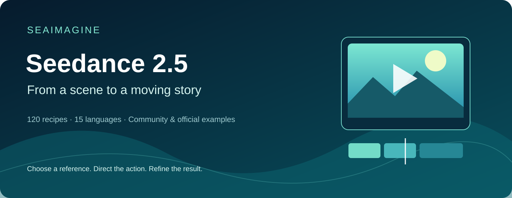
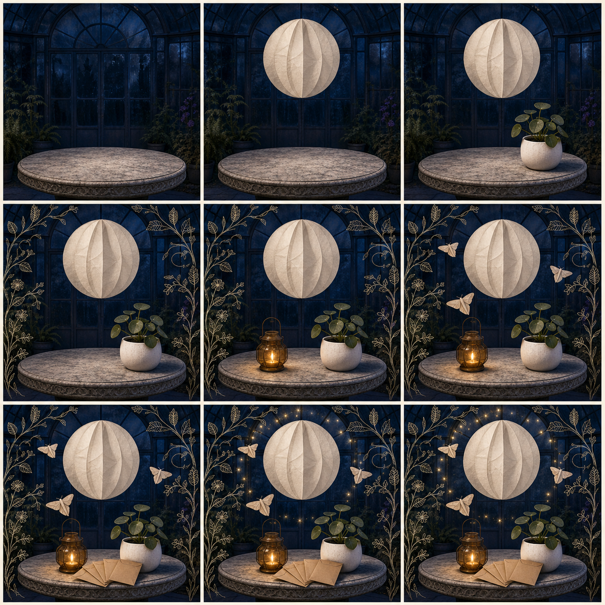
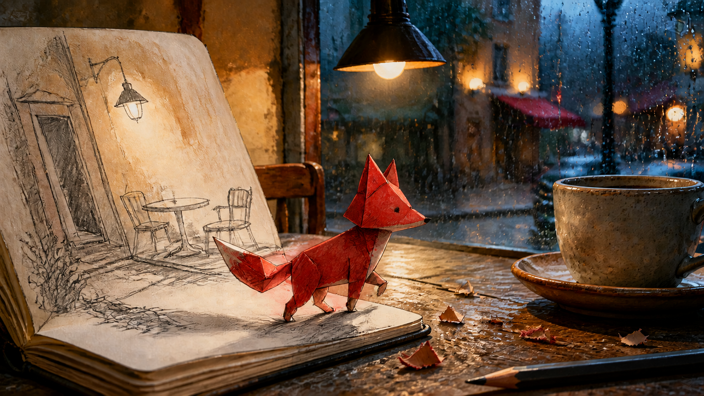

# Awesome Seedance 2.5 Prompts: Video Examples, X Sources & 120 Recipes

[](https://awesome.re)
[](https://seed.bytedance.com/en/seedance2_5)
[](https://seaimagine.com/model/seedance-2-5/)
[](https://seaimagine.com/model/seedance-2-5/)
[](prompts/README.en.md)
[](#seedance-25-videos-from-x--watch-inspect-remix)
[](CONTRIBUTING.md)
[](LICENSE)

[English](README.md) · [简体中文](README_ZH.md) · [日本語](README_JA.md) · [Português](README_PT.md) · [Español](README_ES.md) · [Deutsch](README_DE.md) · [Русский](README_RU.md) · [Français](README_FR.md) · [繁體中文](README_TW.md) · [한국어](README_KO.md) · [ไทย](README_TH.md) · [Tiếng Việt](README_VI.md) · [العربية](README_AR.md) · [Bahasa Indonesia](README_ID.md) · [Italiano](README_IT.md)



A SeaImagine edition of the company’s [Flaq prompt library](https://github.com/flaqai/awesome_seedance_2_5), with **120 complete recipes and 15 language entry points**. The main catalog contains 60 Chinese and 60 English recipes; 14 localized practice files each offer six shared scenes, not a full translation of all 120 recipes. Find copy-ready recipes for text-to-video, image-to-video, multi-reference control, local video editing, extension, synchronized sound, match cuts, tutorials, digital presenters, batch SKU production, long-form chaining, green screen, white-model previs, advertising, ecommerce, genre filmmaking, social video, original animation, visual experiments, education, and cinematic storytelling.

| [Browse 120 prompts](prompts/README.en.md) | [Submit your prompt](https://github.com/seaimagineai/awesome-seedance-2-5-prompts/issues/new?template=prompt.yml) | [Contribution guide](CONTRIBUTING.md) | [Prompting guide](docs/prompting-guide.md) | [Generate with SeaImagine](https://seaimagine.com/model/seedance-2-5/) |
|---|---|---|---|---|

[Watch community videos](#seedance-25-videos-from-x--watch-inspect-remix) · [Copy 120 original recipes](prompts/README.en.md) · [Read source notes](docs/x-showcase-sources.md)

## Choose a starting point

[Copy a short example](#three-copy-ready-seedance-25-prompts) · [Browse by goal](docs/use-case-matrix.en.md) · [Official demos](docs/official-examples.md) · [Generate on SeaImagine](https://seaimagine.com/model/seedance-2-5/) · [All languages](docs/languages.md)

New to video prompting? Try one fixed product and one camera move first. The bottle example below includes its input image. Community videos demonstrate creative approaches; their generation platform has not been independently verified.

## Seedance 2.5 videos from X — watch, inspect, remix

Twelve community posts with a video, an explicit Seedance 2.5 label, and a complete prompt in the post body. Click a preview to open its MP4, read the creator's full prompt on X, or expand a shorter editorial adaptation below. **Upstream source/media check: 2026-09-20; [current research and limits](docs/current-source-check.md).**

The model attribution is the poster's claim; these are community examples, external creator works; their generation platform has not been independently verified. Published video dimensions describe the uploaded file, not necessarily generation settings. The 120 original library recipes remain a separate collection.

| Example | Use case | Original post & full prompt | Video |
|---|---|---|---|
| [X01 · Food ASMR with a comic payoff](#x01-galley-food-comedy) | Food / 3D animation | [@Goodmanprotocol](https://x.com/Goodmanprotocol/status/2099186117769822462) | [▶ MP4](https://video.twimg.com/amplify_video/2099186062715404288/vid/avc1/1920x1080/H8uxwKxVsSU09_LW.mp4?tag=29) |
| [X02 · One garment, multiple fashion hooks](#x02-one-garment-fashion) | Fashion / Ecommerce | [@Goodmanprotocol](https://x.com/Goodmanprotocol/status/2095216981624721691) | [▶ MP4](https://video.twimg.com/amplify_video/2095216899445649408/vid/avc1/1920x1080/LZt4YKiTkMag5Db1.mp4?tag=29) |
| [X03 · A rainy selfie interrupted by a kitten](#x03-rainy-pet-selfie) | Pets / UGC | [@Strength04_X](https://x.com/Strength04_X/status/2098256490238755226) | [▶ MP4](https://video.twimg.com/amplify_video/2098256097547309056/vid/avc1/1920x1080/mPxvxfjQ4VcrZg5r.mp4?tag=29) |
| [X04 · A marker turns the street into animation](#x04-live-action-doodle) | Mixed media / VFX | [@Strength04_X](https://x.com/Strength04_X/status/2095748874942263601) | [▶ MP4](https://video.twimg.com/amplify_video/2095748601087688705/vid/avc1/1280x720/vqE5gA1Hrf63bAyB.mp4?tag=29) |
| [X05 · Everyday moments with a MiniDV look](#x05-minidv-everyday) | Lifestyle / Documentary aesthetic | [@john_my07](https://x.com/john_my07/status/2090287853532266748) | [▶ MP4](https://video.twimg.com/amplify_video/2090287723961847808/vid/avc1/1920x1080/sNtaxz9M_3wvzoTP.mp4?tag=29) |
| [X06 · Two-person convenience-store Vlog](#x06-two-person-vlog) | Lifestyle / Dialogue / Continuity | [@Strength04_X](https://x.com/Strength04_X/status/2097968347430482177) | [▶ MP4](https://video.twimg.com/amplify_video/2097967562604875776/vid/avc1/1920x1080/EB48uw1_u7MU2RJl.mp4?tag=29) |
| [X07 · A talent-show reveal built around the beat drop](#x07-talent-show-reversal) | Performance / Comedy | [@Strength04_X](https://x.com/Strength04_X/status/2090399966988550435) | [▶ MP4](https://video.twimg.com/amplify_video/2090399674129940480/vid/avc1/854x480/8-BwGw71f6WF0sF4.mp4?tag=29) |
| [X08 · A flower-pressing tutorial with tactile ASMR](#x08-pressed-flower-tutorial) | Craft / Tutorial / ASMR | [@Strength04_X](https://x.com/Strength04_X/status/2084269139556761919) | [▶ MP4](https://video.twimg.com/amplify_video/2084268630556983296/vid/avc1/1920x1080/kPWIx5WQsdO1yzGR.mp4?tag=29) |
| [X09 · An energy-powered action scene with readable geography](#x09-energy-action-geography) | Action / VFX / Storytelling | [@Strength04_X](https://x.com/Strength04_X/status/2096147092188311749) | [▶ MP4](https://video.twimg.com/amplify_video/2096146403064254464/vid/avc1/1280x720/MZwL0tlYUawV8djb.mp4?tag=29) |
| [X10 · A day-trip Vlog with a coherent beginning and ending](#x10-day-trip-story-arc) | Travel / Character continuity | [@Goodmanprotocol](https://x.com/Goodmanprotocol/status/2087165084397420849) | [▶ MP4](https://video.twimg.com/amplify_video/2087164966864556033/vid/avc1/1280x720/CxZZE_2r3pzjndH-.mp4?tag=29) |
| [X11 · A kindness micro-story that tests object continuity](#x11-visible-object-handover) | Narrative / Prop ownership | [@AIwithkhan](https://x.com/AIwithkhan/status/2096424933366931946) | [▶ MP4](https://video.twimg.com/amplify_video/2096424851888300032/vid/avc1/1280x720/LYNMJekyiU57XaaC.mp4?tag=29) |
| [X12 · A tropical neighborhood told through small sounds](#x12-tropical-location-sound) | Location sound / Localized lifestyle | [@RishuaVR](https://x.com/RishuaVR/status/2089204108175741157) | [▶ MP4](https://video.twimg.com/amplify_video/2089204070997532672/vid/avc1/1280x720/tqcN58TfdD156uJn.mp4?tag=29) |

**New picks:** [Stage reveal](#x07-talent-show-reversal) · [Craft ASMR](#x08-pressed-flower-tutorial) · [Action VFX](#x09-energy-action-geography) · [Travel diary](#x10-day-trip-story-arc) · [Prop continuity](#x11-visible-object-handover) · [Location sound](#x12-tropical-location-sound)

For a focused first experiment, use the short prop-handover or location-sound variant. For multi-shot work, study the travel diary or stage reveal. Timings are creative briefs: use durations supported by your provider, or split the sequence into shorter shots.

<a id="x01-galley-food-comedy"></a>

### X01 · Food ASMR with a comic payoff

[](https://video.twimg.com/amplify_video/2099186062715404288/vid/avc1/1920x1080/H8uxwKxVsSU09_LW.mp4?tag=29)

[▶ Watch video](https://video.twimg.com/amplify_video/2099186062715404288/vid/avc1/1920x1080/H8uxwKxVsSU09_LW.mp4?tag=29) · [Original X post + full author-published prompt](https://x.com/Goodmanprotocol/status/2099186117769822462) · Posted by **@Goodmanprotocol**, 2026-09-13

A useful reference for timing food sounds around a character-driven payoff.

**Inputs:** Text-only brief; consistent chef and bird designs. **Format:** 30 seconds; published media 1920×1080.

**Original prompt excerpt:** “No dialogue, no subtitles, no text.”

<details>
<summary>Copy the editorial prompt adaptation</summary>

This upstream editorial variant is a starting point for your own generation. It is not the exact prompt used for the linked video and has not been render-tested here.

```text
Create a 30-second animated cooking sketch inside a gently rocking wooden galley. Keep one apron-wearing cook and one curious green bird recognizable in every shot. Warm lanterns illuminate tactile food surfaces.

0–6s: the bird approaches a vegetable; the cook slides the chopping board away and raises an eyebrow.
6–13s: intercut knife contact, oil ripples and bubbling sauce; synchronize each sound with the visible action.
13–22s: the bird nudges an empty serving bowl toward the cook, then waits conspicuously.
22–30s: the cook fills a small dish; both settle beside the window.

Use expressive original character designs, quiet sea ambience and a single closing musical accent. Leave dialogue and lettering out.
```

</details>

<a id="x02-one-garment-fashion"></a>

### X02 · One garment, multiple fashion hooks

[](https://video.twimg.com/amplify_video/2095216899445649408/vid/avc1/1920x1080/LZt4YKiTkMag5Db1.mp4?tag=29)

[▶ Watch video](https://video.twimg.com/amplify_video/2095216899445649408/vid/avc1/1920x1080/LZt4YKiTkMag5Db1.mp4?tag=29) · [Original X post + full author-published prompt](https://x.com/Goodmanprotocol/status/2095216981624721691) · Posted by **@Goodmanprotocol**, 2026-09-02

A practical reference for building a fashion series around one recognizable item.

**Inputs:** One garment anchor and one consistent adult model. **Format:** 30 seconds; source requests 16:9; published media 1920×1080.

**Original prompt excerpt:** “No additional dialogue or narration after the opening line.”

<details>
<summary>Copy the editorial prompt adaptation</summary>

This upstream editorial variant is a starting point for your own generation. It is not the exact prompt used for the linked video and has not been render-tested here.

```text
Produce a 30-second landscape fashion edit featuring one adult model and the same oversized pale-yellow shirt. Use a bright apartment with consistent window light. Preserve the shirt's buttons, seams and color.

0–4s: introduce the garment on a hanger with one short spoken hook.
4–24s: reveal five combinations, four seconds each: open over a tank, tied at the waist, tucked into trousers, layered over a dress, and worn with a narrow belt. Motivate each cut with a sleeve movement or matching shoulder position.
24–30s: hold the final outfit and leave room for an editor-added comparison strip.

Keep fabric weight believable. Add outfit names and captions after generation.
```

</details>

<a id="x03-rainy-pet-selfie"></a>

### X03 · A rainy selfie interrupted by a kitten

[](https://video.twimg.com/amplify_video/2098256097547309056/vid/avc1/1920x1080/mPxvxfjQ4VcrZg5r.mp4?tag=29)

[▶ Watch video](https://video.twimg.com/amplify_video/2098256097547309056/vid/avc1/1920x1080/mPxvxfjQ4VcrZg5r.mp4?tag=29) · [Original X post + full author-published prompt](https://x.com/Strength04_X/status/2098256490238755226) · Posted by **@Strength04_X**, 2026-09-11

Reference for counting subjects and allowing framing to react to a pet's movement.

**Inputs:** One authorized portrait; one consistent kitten. **Format:** 30 seconds; source requests 9:16, but published media is 1920×1080.

**Original prompt excerpt:** “No cuts. No zoom. Exactly one kitten.”

<details>
<summary>Copy the editorial prompt adaptation</summary>

This upstream editorial variant is a starting point for your own generation. It is not the exact prompt used for the linked video and has not been render-tested here.

```text
Make a 30-second phone selfie beside a rain-covered window. One adult holds one tabby kitten securely. Use the supplied portrait only to preserve the person's appearance. Keep window light soft and neutral.

0–7s: the person glances down at the kitten while rain continues behind them.
7–15s: a cloth loop at the cuff attracts one paw; the person moves it aside and chuckles.
15–23s: the kitten shifts toward the supported shoulder; the phone tilts slightly as the person adjusts their grip.
23–30s: whiskers approach the lens, focus briefly softens, and the shot ends during a laugh.

Use room sound and rain. Preserve one continuous viewpoint and the same animal.
```

</details>

<a id="x04-live-action-doodle"></a>

### X04 · A marker turns the street into animation

[](https://video.twimg.com/amplify_video/2095748601087688705/vid/avc1/1280x720/vqE5gA1Hrf63bAyB.mp4?tag=29)

[▶ Watch video](https://video.twimg.com/amplify_video/2095748601087688705/vid/avc1/1280x720/vqE5gA1Hrf63bAyB.mp4?tag=29) · [Original X post + full author-published prompt](https://x.com/Strength04_X/status/2095748874942263601) · Posted by **@Strength04_X**, 2026-09-04

Reference for giving every transformation a visible trigger and preserving spatial position.

**Inputs:** Text brief; persistent hand and marker; repeated transformation rule. **Format:** 15 seconds; source requests 9:16, but published media is 1280×720.

**Original prompt excerpt:** “No cuts. No scene transitions.”

<details>
<summary>Copy the editorial prompt adaptation</summary>

This upstream editorial variant is a starting point for your own generation. It is not the exact prompt used for the linked video and has not been render-tested here.

```text
Create a 15-second handheld walk along a quiet city pavement. A visible hand holds a marker. Each pointing gesture triggers a brief blue outline, followed by a flat illustrated version of the targeted object. Keep its location, apparent size and perspective unchanged.

0–5s: point at a parked bicycle; ink follows its frame and replaces the surface with cel shading.
5–10s: pan toward a stationary scooter; repeat the same transformation after the gesture.
10–15s: a ribbon of drawn color crosses the pavement and stops at the curb; surrounding buildings stay photographic.

Match contact shadows to the afternoon sun. Use street ambience and short pen sounds. Finish without generated lettering.
```

</details>

<a id="x05-minidv-everyday"></a>

### X05 · Everyday moments with a MiniDV look

[](https://video.twimg.com/amplify_video/2090287723961847808/vid/avc1/1920x1080/sNtaxz9M_3wvzoTP.mp4?tag=29)

[▶ Watch video](https://video.twimg.com/amplify_video/2090287723961847808/vid/avc1/1920x1080/sNtaxz9M_3wvzoTP.mp4?tag=29) · [Original X post + full author-published prompt](https://x.com/john_my07/status/2090287853532266748) · Posted by **@john_my07**, 2026-08-20

Reference for specifying camera imperfections and stable everyday props.

**Inputs:** Text brief; one adult subject with fixed appearance. **Format:** 30 seconds; source requests 1080p; published media 1920×1080.

**Original prompt excerpt:** “Only spoken dialogue: “Annyeong.””

<details>
<summary>Copy the editorial prompt adaptation</summary>

This upstream editorial variant is a starting point for your own generation. It is not the exact prompt used for the linked video and has not been render-tested here.

```text
Create a fictional 30-second home-movie scene on a quiet residential lane. Follow one adult wearing the same casual clothes throughout. Use a consumer-camcorder look: mild sensor noise, soft contrast, delayed reframing and occasional focus correction.

0–8s: the subject straightens a sleeve at the doorway, notices the camera and smiles.
8–16s: follow them to a laundry line; a cloth slips slightly before being secured.
16–23s: they sit on a terrace, lift one ceramic mug and lower it without changing its shape.
23–30s: they respond to the person filming with a brief greeting, then walk away. Stop recording mid-step.

Keep only location sound and natural speech. Maintain stable hands, cup and background objects.
```

</details>

<a id="x06-two-person-vlog"></a>

### X06 · Two-person convenience-store Vlog

[](https://video.twimg.com/amplify_video/2097967562604875776/vid/avc1/1920x1080/EB48uw1_u7MU2RJl.mp4?tag=29)

[▶ Watch video](https://video.twimg.com/amplify_video/2097967562604875776/vid/avc1/1920x1080/EB48uw1_u7MU2RJl.mp4?tag=29) · [Original X post + full author-published prompt](https://x.com/Strength04_X/status/2097968347430482177) · Posted by **@Strength04_X**, 2026-09-10

Reference for explicitly assigning the phone operator and prop ownership.

**Inputs:** Two identity references; rear-camera and selfie roles defined separately. **Format:** 30 seconds; source requests 4:3 and 720p, but published media is 1920×1080.

**Original prompt excerpt:** “Fixed 1.0x lens, no zoom.”

<details>
<summary>Copy the editorial prompt adaptation</summary>

This upstream editorial variant is a starting point for your own generation. It is not the exact prompt used for the linked video and has not been render-tested here.

```text
Create a 30-second evening convenience-store Vlog with two adult friends. Image 1 defines the shopper; Image 2 defines the friend filming. Keep clothing and one drink bottle consistent.

0–8s: rear-camera view follows the shopper noticing a chilled drink and taking it from the refrigerator.
8–15s: the shopper shows the bottle to the lens, then carries it to the counter; the operator speaks off-screen.
15–23s: cut to a front-camera two-shot outside. One friend offers the other a small sip, with a visible handover.
23–30s: they laugh and leave together, the bottle remaining with its current holder.

Use modest phone shake, short conversational pauses and shop ambience. No external observer angle or music.
```

</details>


<a id="x07-talent-show-reversal"></a>

### X07 · A talent-show reveal built around the beat drop

[](https://video.twimg.com/amplify_video/2090399674129940480/vid/avc1/854x480/8-BwGw71f6WF0sF4.mp4?tag=29)

[▶ Watch video](https://video.twimg.com/amplify_video/2090399674129940480/vid/avc1/854x480/8-BwGw71f6WF0sF4.mp4?tag=29) · [Original X post + full author-published prompt](https://x.com/Strength04_X/status/2090399966988550435) · Posted by **@Strength04_X**, 2026-08-20

**What to learn:** Study contrast between a quiet setup and a timed reveal; reaction shots make the transformation legible.

**Inputs:** Text brief with a locked performer design. **Format:** 30-second source brief; uploaded video 854×480, about 30.08 seconds. The post credits @techhalla for the prompt idea.

**Original prompt excerpt:** “Warm introduction and gentle dialogue”

<details>
<summary>Copy the editorial prompt adaptation</summary>

This upstream editorial variant is a starting point for your own generation. It is not the exact prompt used for the linked video and has not been render-tested here.

```text
Create a fictional 24-second community talent-show clip. The performer is an older man in a burgundy waistcoat and white trainers; keep his age, face and costume unchanged. Use an original stage design without broadcast branding.

0–7s: a wide shot introduces him carrying a folded newspaper. He sets it on a stool while the audience settles.
7–9s: close-up as he taps one shoe twice; the room becomes quiet.
9–19s: an original funk rhythm begins. Show nimble upright footwork, then alternate full-body shots with two surprised spectators. Keep each move physically readable.
19–24s: he ends with a small bow and retrieves the newspaper. Applause grows naturally.

Keep cuts aligned with musical accents. Avoid age transformation, impossible joint positions and disappearing props.
```

</details>

<a id="x08-pressed-flower-tutorial"></a>

### X08 · A flower-pressing tutorial with tactile ASMR

[](https://video.twimg.com/amplify_video/2084268630556983296/vid/avc1/1920x1080/kPWIx5WQsdO1yzGR.mp4?tag=29)

[▶ Watch video](https://video.twimg.com/amplify_video/2084268630556983296/vid/avc1/1920x1080/kPWIx5WQsdO1yzGR.mp4?tag=29) · [Original X post + full author-published prompt](https://x.com/Strength04_X/status/2084269139556761919) · Posted by **@Strength04_X**, 2026-08-03

**What to learn:** Separate preparation from the finished result so a craft tutorial does not imply an impossible instant drying process.

**Inputs:** Text brief; consistent work surface and unbranded craft tools. **Format:** Source storyboard totals 32 seconds; uploaded video is about 31.33 seconds at 1920×1080.

**Original prompt excerpt:** “petals rustling, paper pages turning, book weight settling”

<details>
<summary>Copy the editorial prompt adaptation</summary>

This upstream editorial variant is a starting point for your own generation. It is not the exact prompt used for the linked video and has not been render-tested here.

```text
Make a 20-second craft tutorial at a pale wooden desk beside a window. An adult maker wears a sage apron; maintain the same tools, hands and lighting across shots.

0–5s: overhead view of three small blossoms placed on absorbent paper. Leave space between petals.
5–10s: a close-up follows tweezers straightening one curled edge. Another sheet is lowered and a wooden flower press is tightened.
10–12s: cut clearly to a separate tray of flowers prepared on an earlier day; do not show fresh flowers drying instantly.
12–17s: arrange the dried pieces on a blank greeting card, keeping their positions stable.
17–20s: hold on the finished card beside the closed press.

Record paper friction, tweezer taps and screw turns. No music or on-screen lettering; favor restrained camera movement and believable fingers.
```

</details>

<a id="x09-energy-action-geography"></a>

### X09 · An energy-powered action scene with readable geography

[](https://video.twimg.com/amplify_video/2096146403064254464/vid/avc1/1280x720/MZwL0tlYUawV8djb.mp4?tag=29)

[▶ Watch video](https://video.twimg.com/amplify_video/2096146403064254464/vid/avc1/1280x720/MZwL0tlYUawV8djb.mp4?tag=29) · [Original X post + full author-published prompt](https://x.com/Strength04_X/status/2096147092188311749) · Posted by **@Strength04_X**, 2026-09-05

**What to learn:** Treat energy as a light source, and keep the actor, obstacle and landing zone spatially consistent.

**Inputs:** Text brief; fictional characters. Adaptation changes the setting to adult stunt training. **Format:** 30-second source brief; uploaded video 1280×720, about 30.17 seconds. Source wording asks for a 4K aesthetic; this is not evidence of native 4K output.

**Original prompt excerpt:** “Emerald light reflects realistically across tables, windows and characters”

<details>
<summary>Copy the editorial prompt adaptation</summary>

This upstream editorial variant is a starting point for your own generation. It is not the exact prompt used for the linked video and has not been render-tested here.

```text
Create an 18-second fictional stunt-training scene inside an empty industrial studio. One adult performer in a charcoal tracksuit faces a padded rolling target. Establish the target on screen right and a clear landing mat behind it.

0–5s: a slow medium push-in reveals a dim amber glow gathering around the performer's palms. Let that light spill onto sleeves and the concrete floor.
5–12s: a lateral wide shot follows a controlled sidestep, a short run and one rehearsed palm strike. The target rolls backward along its existing track; keep the entire contact readable.
12–18s: a closer shot shows the glow fading as the performer lowers both hands and exhales.

Use a short low-frequency pulse at contact and natural room reverb. No gore, identity changes, unexplained camera-axis reversals or teleporting equipment.
```

</details>

<a id="x10-day-trip-story-arc"></a>

### X10 · A day-trip Vlog with a coherent beginning and ending

[](https://video.twimg.com/amplify_video/2087164966864556033/vid/avc1/1280x720/CxZZE_2r3pzjndH-.mp4?tag=29)

[▶ Watch video](https://video.twimg.com/amplify_video/2087164966864556033/vid/avc1/1280x720/CxZZE_2r3pzjndH-.mp4?tag=29) · [Original X post + full author-published prompt](https://x.com/Goodmanprotocol/status/2087165084397420849) · Posted by **@Goodmanprotocol**, 2026-08-11

**What to learn:** Use recurring wardrobe and a carried object to connect locations without pretending the whole trip is a single take.

**Inputs:** Source asks for a woman reference image; use a fictional adult or a likeness you have permission to use. **Format:** 30-second source brief; uploaded video 1280×720, about 30.08 seconds.

**Original prompt excerpt:** “one continuous, coherent day”

<details>
<summary>Copy the editorial prompt adaptation</summary>

This upstream editorial variant is a starting point for your own generation. It is not the exact prompt used for the linked video and has not been render-tested here.

```text
Using an authorized adult character reference, create a 24-second casual day-trip diary. Keep the same face, olive jacket and canvas shoulder bag in every location. A friend operates the handheld camera; use ordinary edits between places, not an impossible continuous take.

0–6s: at a tram stop, the traveler checks a paper route map and points toward the arriving tram.
6–12s: outside a small bakery, they place the folded map into the bag and unwrap a pastry.
12–18s: follow them along a riverside path. A breeze moves the jacket while cyclists pass at a safe distance.
18–24s: they sit on a bench under warm evening light and open the same map again.

Allow brief reframing delays and natural expressions. Keep transit noise, footsteps and river ambience; omit branding and exaggerated influencer poses.
```

</details>

<a id="x11-visible-object-handover"></a>

### X11 · A kindness micro-story that tests object continuity

[](https://video.twimg.com/amplify_video/2096424851888300032/vid/avc1/1280x720/LYNMJekyiU57XaaC.mp4?tag=29)

[▶ Watch video](https://video.twimg.com/amplify_video/2096424851888300032/vid/avc1/1280x720/LYNMJekyiU57XaaC.mp4?tag=29) · [Original X post + full author-published prompt](https://x.com/AIwithkhan/status/2096424933366931946) · Posted by **@AIwithkhan**, 2026-09-06

**What to learn:** Describe ownership before, during and after a handover instead of merely requesting 'perfect continuity'.

**Inputs:** Text brief; adaptation uses two fictional adults and one identifiable prop. **Format:** 30-second source brief; uploaded video 1280×720, about 30.04 seconds.

**Original prompt excerpt:** “Balloon stays with the girl after being handed over.”

<details>
<summary>Copy the editorial prompt adaptation</summary>

This upstream editorial variant is a starting point for your own generation. It is not the exact prompt used for the linked video and has not been render-tested here.

```text
Create a 15-second neighborhood micro-story with two fictional adults. A cyclist wearing a blue raincoat has dropped one yellow glove beside a bench. A passerby carrying a red tote notices it.

0–4s: show the glove on the pavement and the cyclist looking back from the bicycle. Establish both people in one wide shot.
4–9s: the passerby bends, picks up the glove with the right hand and approaches. Keep the red tote on the left shoulder.
9–12s: show both hands in frame during the transfer. The cyclist closes the left hand around the glove before the passerby releases it.
12–15s: the cyclist says 'Thanks!' and places the glove in the front basket.

Use one gentle handheld move, neighborhood ambience and no music. Exactly one glove throughout; preserve its color, location and holder.
```

</details>

<a id="x12-tropical-location-sound"></a>

### X12 · A tropical neighborhood told through small sounds

[](https://video.twimg.com/amplify_video/2089204070997532672/vid/avc1/1280x720/tqcN58TfdD156uJn.mp4?tag=29)

[▶ Watch video](https://video.twimg.com/amplify_video/2089204070997532672/vid/avc1/1280x720/tqcN58TfdD156uJn.mp4?tag=29) · [Original X post + full author-published prompt](https://x.com/RishuaVR/status/2089204108175741157) · Posted by **@RishuaVR**, 2026-08-17

**What to learn:** Name sounds by distance and visible cause; local detail is more useful than a generic 'cinematic audio' request.

**Inputs:** Text brief with a fixed fictional adult and place-specific environment. **Format:** 10-second source brief; uploaded video 1280×720, about 10.08 seconds.

**Original prompt excerpt:** “Pure natural foley textures”

<details>
<summary>Copy the editorial prompt adaptation</summary>

This upstream editorial variant is a starting point for your own generation. It is not the exact prompt used for the linked video and has not been render-tested here.

```text
Create a 12-second fictional home-video moment on a shaded Indonesian residential terrace. An adult in a loose teal shirt sets a glass of iced tea on a low bamboo table. Keep appearance and clothing stable.

0–4s: frame the table from a seated friend's viewpoint. The glass touches wood with a soft tap; ice settles a moment later.
4–8s: the subject pulls a chair closer and turns toward a distant bicycle bell. Leaves cast shifting shadows on the wall.
8–12s: the camera drifts toward potted plants as a light breeze arrives, then the recording ends naturally.

Mix near sounds clearly: glass, chair scrape and cloth movement. Keep birds and the bicycle quieter and farther away. Use modest exposure adjustment, soft consumer-camera detail and no narration, music or stylized transitions.
```

</details>

Videos and thumbnails remain on the original media host. If a media URL changes, use its X post link. External media and quoted excerpts retain their respective owners' rights and are not covered by this repository's MIT license. See the [source records and selection notes](docs/x-showcase-sources.md).

## Official demonstrations

These ByteDance Seed demos show camera planning and reference control. They are official model demonstrations, not SeaImagine outputs.

| Case | Official video |
|---|---|
| Backstage to stage: a continuous camera route | [▶ MP4](https://lf3-static.bytednsdoc.com/obj/eden-cn/lapzild-tss/ljhwZthlaukjlkulzlp/user-upload/4xfa4ms8egv8p.mp4) |
| Clay render to fantasy: separate structure and appearance | [▶ MP4](https://lf3-static.bytednsdoc.com/obj/eden-cn/lapzild-tss/ljhwZthlaukjlkulzlp/user-upload/4xfa4ms8avi1f.mp4) |

[All nine official demos and learning notes](docs/official-examples.md) · [ByteDance Seed](https://seed.bytedance.com/en/blog/one-take-creation-flexible-referencing-introducing-seedance-2-5)

## Share your Seedance 2.5 prompt

Built something that other creators or developers can reproduce? [Open the guided submission form](https://github.com/seaimagineai/awesome-seedance-2-5-prompts/issues/new?template=prompt.yml) and share one original, tested prompt with its model settings, input roles, real output, and iteration notes. Useful submissions may be edited for clarity and added with attribution.

We especially welcome multilingual prompts, real business workflows, accessibility-focused examples, controlled video edits, multi-reference tests, honest failure reports, and original reference assets. Do not submit copied collections, secrets, private data, unauthorized likenesses, protected characters, unlicensed media, unverifiable claims, or undisclosed affiliate links. See [CONTRIBUTING.md](CONTRIBUTING.md) for the review checklist.

## Create with SeaImagine

Start with [Seedance 2.5 on SeaImagine](https://seaimagine.com/model/seedance-2-5/) for text-led shots or an existing product, portrait or illustration. Use [SeaImagine Create](https://seaimagine.com/create/) as the creative workspace and [AI Image Generator](https://seaimagine.com/ai-image-generator/) to prepare reference artwork.

1. Pick one prompt and replace its subject, setting and visual anchors.
2. Upload the matching reference image when the prompt requires one.
3. Select settings offered by the live interface; begin with a short motion test.
4. Review hands, product shape, sound and the final frame before extending the sequence.

The public model page describes 5–30 seconds in five-second steps and 480p/720p output. Advanced library recipes may require controls available on other implementations of the model. Public page descriptions are not a completed generation test or an uptime guarantee. See [the practical workflow and capability notes](docs/seaimagine-workflow.md).

## Find the right prompt in under a minute

| If you need… | Start here |
|---|---|
| A video example with its original X post and published prompt | [Community video showcase](#seedance-25-videos-from-x--watch-inspect-remix) |
| One complete prompt to customize | [120-prompt master index](prompts/README.en.md) |
| A product, ad, UGC, or creator-video recipe | [Foundation prompts 04–09](prompts/prompt-library.md) |
| UI, education, real estate, mobility, pet, or industry content | [Extended prompts 37–60](prompts/extended-scenarios.md) |
| SaaS, creator, jewelry, culture, clean-energy, accessibility, or game content | [Advanced English workflows 61–72](prompts/advanced-workflows.en.md) |
| Match cuts, one-takes, tutorials, video edits, batch SKUs, digital presenters, extension, or previs | [Creative techniques 73–100](prompts/creative-techniques.en.md) |
| Genre films, safe vehicle shots, social comedy, audio sync, original animation, dynamic posters, or material morphs | [Genre, social & visual experiments 101–120](prompts/genre-social-experiments.en.md) |
| A prompt in your preferred language | [15-language prompt directory](prompts/i18n/README.md) |
| Help choosing by business goal or available asset | [English use-case matrix](docs/use-case-matrix.en.md) |
| Better camera, timing, sound, continuity, or negative constraints | [Advanced prompting guide](docs/prompting-guide.md) |
| Choosing a SeaImagine starting point | [SeaImagine model workflow](docs/seaimagine-workflow.md) |

### What is included

- **120 full recipes**, not one-line prompt fragments: each includes mode, references, timeline, camera, sound, continuity, and exclusions. The core 60-scene catalog is in Simplified Chinese, with 60 additional professional, creative-technique, genre, social, and visual-experiment workflows in English.
- **15-language support**, including 14 independent localized prompt files with six complete shared test scenes in each language.
- **20+ practical categories** for brand, ecommerce, UGC, travel, food, fashion, beauty, cinematic, animation, sports, fantasy, VFX, UI, social, education, architecture, mobility, nature, industry, and hospitality workflows.
- **Production guidance** for prompt debugging, aspect-ratio planning, reference ownership, final-frame design, rights review, and iteration records.

## New Seedance 2.5 prompts for genre films, social video, and visual experiments

Prompts 101–120 turn popular creative patterns into production-safe, original briefs: closed-course motorsport, analog drama, orbital science, fantasy flight, natural-history reconstruction, percussion sync, vertical comedy, accessible fashion, motion-reference transfer, original animation, workplace short drama, and material morphing.



This reference image was created in the Flaq source collection for [Prompt 115: Night Garden Dynamic Event Poster](prompts/genre-social-experiments.en.md#115-night-garden-dynamic-event-poster). Its nine panels are cumulative keyframes rather than copied frames, and the full reusable generation brief is documented in [Original Image Prompt Notes](assets/IMAGE_PROMPTS.md).

## What makes a strong Seedance 2.5 prompt?

The official Seedance 2.5 page highlights video generation up to 30 seconds in one pass, two extensions, more precise interpretation of reference videos, broader audio-visual editing, professional camera movement, performance blocking, white-model control, and green-screen editing. A useful prompt should therefore read like a compact directing brief, not a pile of style adjectives.

```text
[Mode] Text-to-video / Image-to-video / Reference-to-video / Edit
[Goal] Use, audience, emotion, duration, aspect ratio
[Reference roles] Image 1 locks identity; Video 1 provides camera path only
[Visual anchors] Subject, wardrobe, product geometry, set, time, palette
[Timeline] Establishment -> action -> turn -> final frame
[Camera] Shot size, height, path, speed, focus, stopping point
[Performance and physics] Gaze, hands, weight, inertia, contact, cloth, water
[Audio] Dialogue, ambience, foley, music, synchronization cues
[Continuity] What must never change
[Avoid] Morphing, duplicates, extra limbs, fake text, logos, watermarks
```

For the full method, see [Seedance 2.5 Prompting Guide: From Brief to Usable Video](docs/prompting-guide.md).

## Three copy-ready Seedance 2.5 prompts

### Cinematic storm rescue training


Use this source-library reference image as the starting image. This is a still reference, not a generated video result.

```text
Use the input image as the first frame and only visual anchor. Preserve the identities and orange rain gear of the two adult volunteers, the rescue boat geometry, the number of people, the lighthouse position, and the cold storm lighting.

00:00-00:07: Track steadily from water level behind the boat. The hull rises and falls with real weight; spray briefly crosses the lens guard; the lighthouse beam sweeps through rain.
00:07-00:15: Slide forward along the side to the volunteers' shoulders. The front volunteer points toward the safe channel while the rear volunteer adjusts the throttle.
00:15-00:23: A side wave pushes the boat left. Both lower their center of gravity and correct course. Raise the camera slightly to reveal the passage through the rocks; water inertia and body balance must be physically plausible.
00:23-00:30: Enter calmer harbor water. Push past the volunteers toward the lighthouse and stop on a wide, hopeful final frame.

Audio: stereo rain, waves, engine, two short safety calls, and a very soft low string tone at the end. No casualties, added people, altered boat parts, teleporting camera, text, logos, or watermark.
```

### Premium unbranded sparkling-tea ad


Use this source-library reference image as the starting image. This is a still reference, not a generated video result.

```text
Use the bottle in the input image as the only product anchor. Preserve its silhouette, cap, blank-label proportions, amber liquid level, and lighting. Generate no text.

00:00-00:05: Macro focus on condensation, then rack focus to fine bubbles rising in the liquid.
00:05-00:11: Orbit clockwise by about 35 degrees while slowly pulling back. The ice pedestal refracts accurately; two tea leaves travel in the opposite direction for layered motion. The bottle remains stable.
00:11-00:17: A warm backlight passes behind the bottle. The cap lifts only slightly with a clean click and releases a natural mist, not an explosion.
00:17-00:24: Lower to a subtle hero angle. Droplets fall naturally, then stop on a clean front view with negative space above for post-production copy.

Audio: cap click, fine carbonation, light ice sound, minimal fresh rhythm. No fake text, extra bottles, label drift, melting glass, trademarks, or watermark.
```

### Paper fox leaves a sketchbook



Use this source-library reference image as the starting image. This is a still reference, not a generated video result.

```text
Use the input image as the art and character anchor. Preserve the red paper fox's triangular ears, pointed nose, folds, pencil texture, and proportions; preserve the café table, sketchbook, lamp, rainy window, and cup layout.

00:00-00:07: Pencil lines tremble slightly. The fox blinks and raises one front paw as the camera makes a macro push-in.
00:07-00:14: The fox steps over the page edge, transitioning naturally from flat graphite lines to dimensional folded paper with correct contact shadows.
00:14-00:21: Track parallel as it walks around pencil shavings and studies the steam above the cup.
00:21-00:27: Steam forms a brief path toward the rainy window. The fox trots after it while tiny tabletop droplets react to its steps.
00:27-00:30: It stops at the window with a consistent reflection. Raise the camera and finish on an open-ended sense of departure.

Audio: rain, paper folds, wood contact, and minimal glockenspiel. No extra animals, redesign, franchise resemblance, text, logos, or watermark.
```

## Full prompt library

Open the [120-prompt master index](prompts/README.en.md), the [24-scene foundation library](prompts/prompt-library.md), the [36-scene extended library](prompts/extended-scenarios.md), the [12 advanced English workflows](prompts/advanced-workflows.en.md), the [28 creative-technique prompts](prompts/creative-techniques.en.md), or the [20 genre, social, and visual-experiment prompts](prompts/genre-social-experiments.en.md). Use the [English use-case matrix](docs/use-case-matrix.en.md) to filter by goal and input asset. Together they cover:

- cinematic drama and science fiction;
- product, skincare, beverage, and wearable ads;
- vertical UGC, travel diaries, and food reviews;
- paper craft, clay animation, and living murals;
- climbing, tennis, and street dance;
- jazz, bakery ASMR, and radio drama;
- portrait micro-expressions, architectural parallax, and start/end frames;
- green screen, white-model previs, reference camera paths, and precise editing.
- SaaS launches, creator courses, assembly proof, jewelry, museums, clean energy, telehealth onboarding, podcasts, logistics UI, accessibility, and original game concepts.
- object-centered match cuts, continuous room transitions, multi-reference tutorials, local edits, SKU batches, multilingual presenters, motion transfer, long-form chaining, extension, region editing, and white-model-to-final rendering.
- safe genre filmmaking, analog memory shorts, space and archaeology explainers, social mockumentaries, dialogue memes, accessible fashion transitions, dynamic posters, original duel and mecha animation, and controlled material morphs.

### Complete prompt files in more languages

- [English](prompts/i18n/prompt-library.en.md), [Traditional Chinese](prompts/i18n/prompt-library.zh-TW.md), [Japanese](prompts/i18n/prompt-library.ja.md), and [Korean](prompts/i18n/prompt-library.ko.md);
- [Spanish](prompts/i18n/prompt-library.es.md), [French](prompts/i18n/prompt-library.fr.md), [German](prompts/i18n/prompt-library.de.md), and [Brazilian Portuguese](prompts/i18n/prompt-library.pt-BR.md);
- [Arabic](prompts/i18n/prompt-library.ar.md), [Russian](prompts/i18n/prompt-library.ru.md), and [Bahasa Indonesia](prompts/i18n/prompt-library.id.md).
- [Italian](prompts/i18n/prompt-library.it.md), [Thai](prompts/i18n/prompt-library.th.md), and [Vietnamese](prompts/i18n/prompt-library.vi.md).

Each language file contains six complete, copy-ready recipes rather than translated titles alone. See the [localization rules and language matrix](prompts/i18n/README.md).

## Image-to-video checklist

- Lock identity, wardrobe, product shape, object count, composition, and key-light direction.
- Separate subject motion, environmental motion, and camera motion.
- Give each reference file one job; never say “use everything from all references.”
- Describe the camera's start, path, speed, and final stopping point.
- Reserve the final 4–6 seconds for deceleration and a deliberate end frame.
- Add dialogue, ambience, foley, and music as separate audio layers.
- Use original or properly licensed people, music, products, and visual assets.

## Seedance 2.5 prompt FAQ

### What is a Seedance 2.5 prompt?

A Seedance 2.5 prompt is a directing brief for a generated video. Strong prompts define the goal, reference roles, visual anchors, timed actions, camera path, physical behavior, sound, continuity, and concrete failure conditions.

### Should I use Text-to-Video or Image-to-Video?

Use [Text-to-Video](https://seaimagine.com/model/seedance-2-5/) when you are exploring from a concept or script. Use [Image-to-Video](https://seaimagine.com/model/seedance-2-5/) when a product, person, illustration, composition, first frame, or end frame must remain recognizable.

### How do I keep a person or product consistent?

Name one primary identity or product anchor, list its invariant properties before describing motion, assign one job to every other reference, and reject redesign, part-count changes, label drift, or identity drift explicitly. Test this anchor before adding elaborate effects.

### Can Seedance 2.5 prompts be written in different languages?

This repository supports 15 languages. The shared multilingual set keeps the same six scene IDs so teams can compare instruction following, UI text, speech, audio, and cultural localization without changing the production brief.

### Are these prompts free to use?

The repository is released under the [MIT License](LICENSE). Generated output may still involve separate rights for source images, people, voices, music, trademarks, locations, claims, and the platform or model used to create it.

## Contributing

New original scenarios, careful localizations, accessibility improvements, and reproducible visual references are welcome. Read [CONTRIBUTING.md](CONTRIBUTING.md) for the prompt format, localization requirements, originality rules, and review checklist.

## Sources and usage

- [Official Seedance 2.5 capability page](https://seed.bytedance.com/en/seedance2_5)
- [Seedance 2.5 Text-to-Video on SeaImagine](https://seaimagine.com/model/seedance-2-5/)
- [Seedance 2.5 Image-to-Video on SeaImagine](https://seaimagine.com/model/seedance-2-5/)
- [Official Seedance 2.0 launch notes](https://seed.bytedance.com/en/blog/seedance-2-0-official-launch)
- [ZeroLu/awesome-seedance](https://github.com/ZeroLu/awesome-seedance) — reviewed for broad use-case discovery; no prompt text, branded example, named style, or visual asset was copied.

The 120 library recipes and six retained PNG reference/illustration assets come from the Flaq source collection; SeaImagine adaptation and the SVG cover are new. See [provenance and license boundaries](docs/PROVENANCE.md). The X showcase separately credits external posts, videos, thumbnails, and short prompt excerpts; its copyable editorial variants are clearly labeled. Linking a community video does not make it a repository-owned asset or grant permission to reuse it. Review generated output and input rights before commercial use.

The reproducible visual briefs are documented in [Original Image Prompt Notes](assets/IMAGE_PROMPTS.md).
