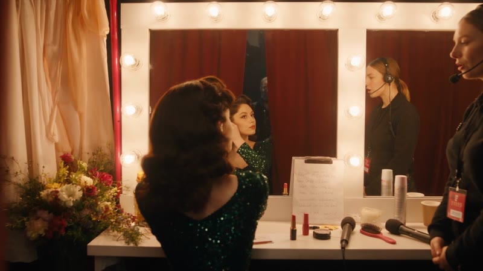
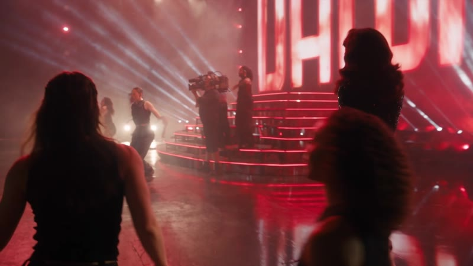
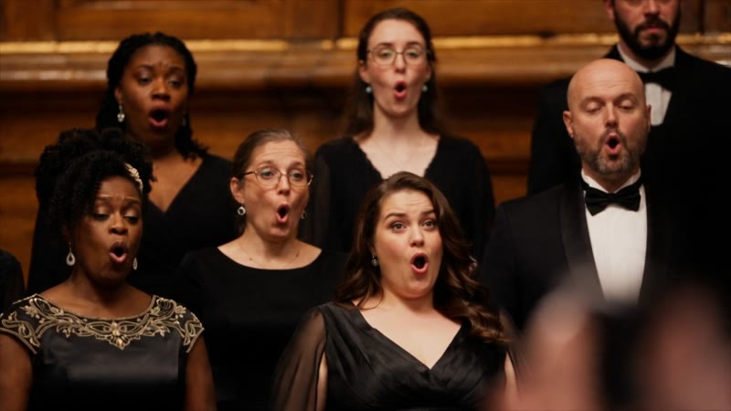
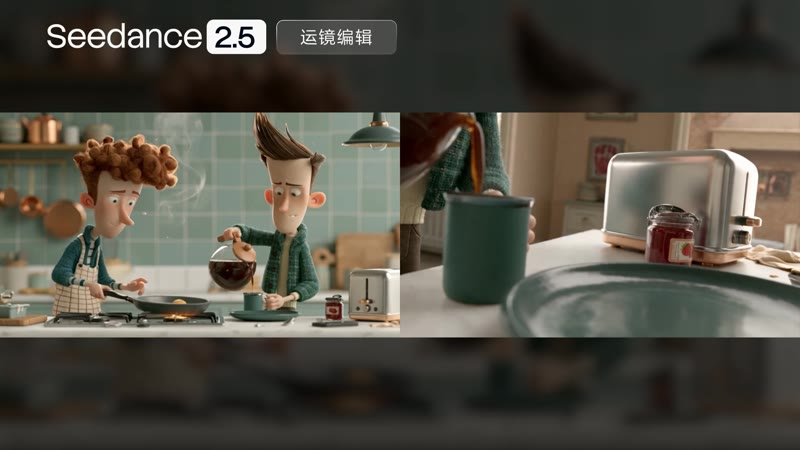
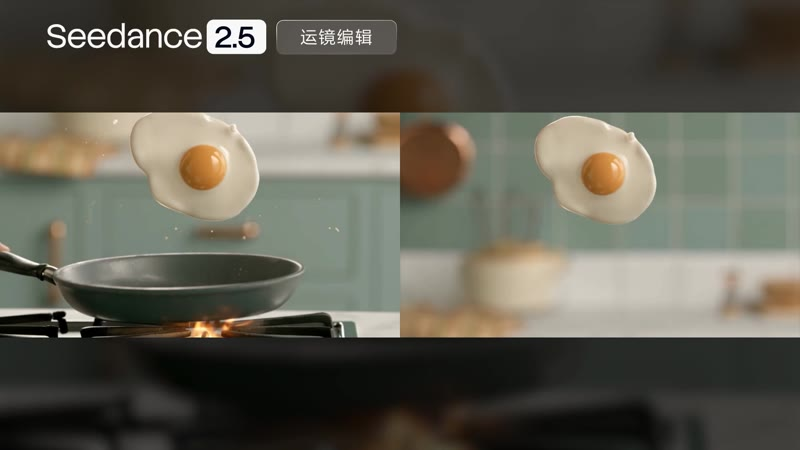
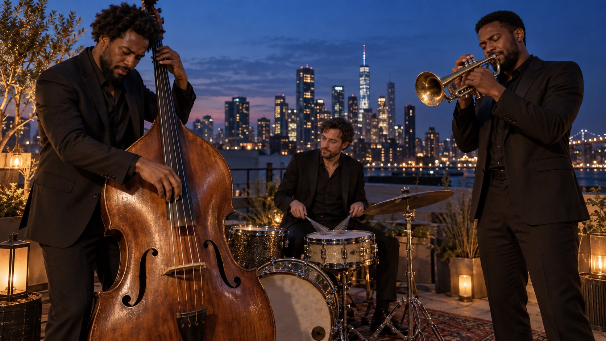
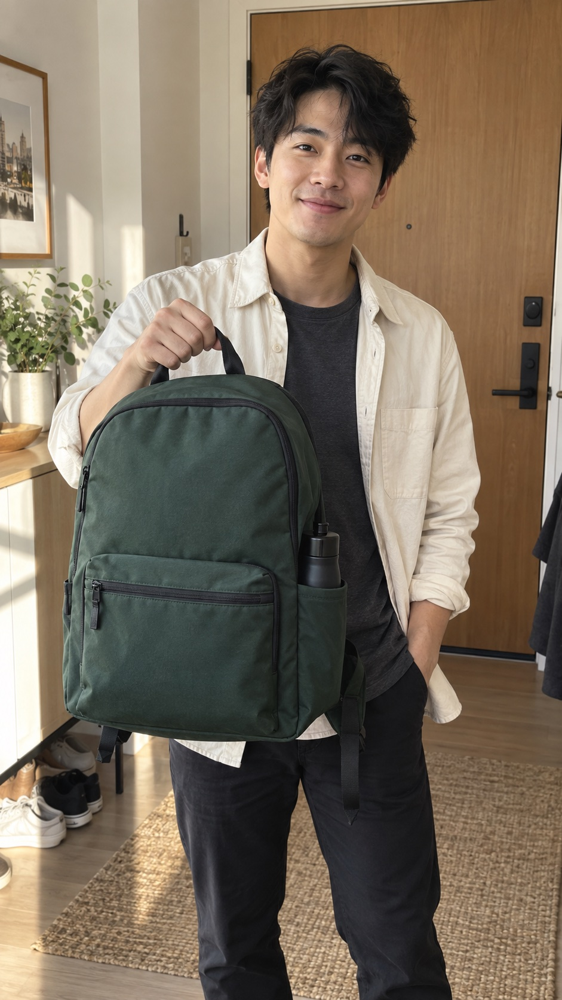
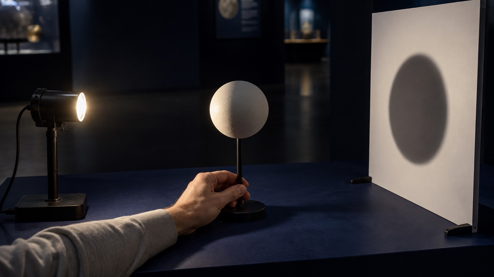
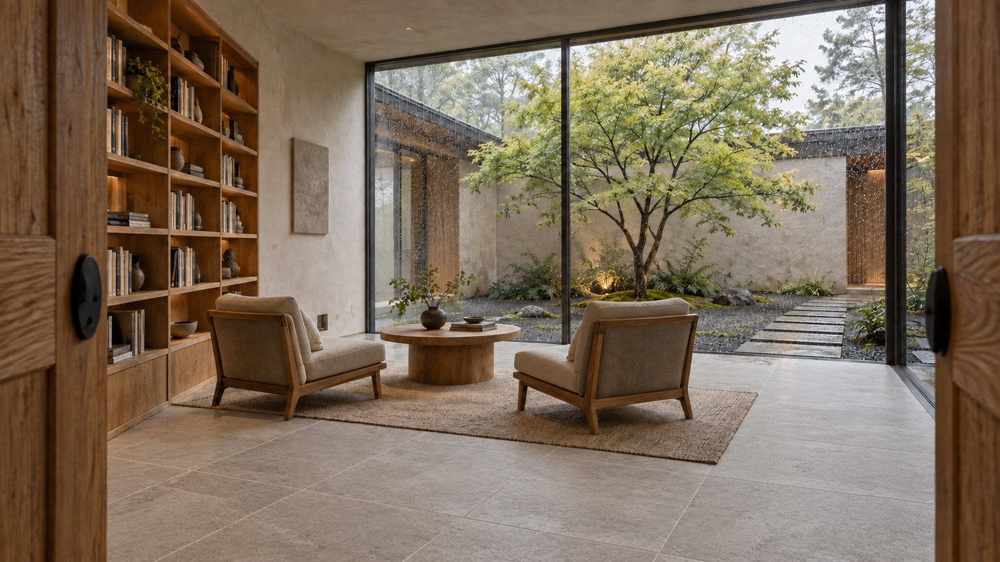
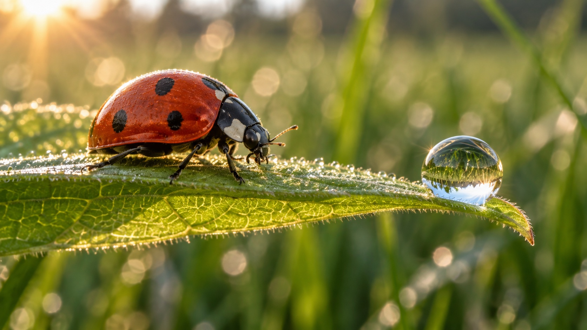

# Awesome Seedance 2.5 Prompts: Video Examples, X Sources & 120 Recipes

[](https://awesome.re)
[](https://seed.bytedance.com/en/seedance2_5)
[](https://seaimagine.com/model/seedance-2-5/)
[](https://seaimagine.com/model/seedance-2-5/)
[](prompts/README.en.md)
[](#seedance-25-videos-from-x--watch-inspect-remix)
[](CONTRIBUTING.md)

[English](README.md) · [简体中文](README_ZH.md) · [日本語](README_JA.md) · [Português](README_PT.md) · [Español](README_ES.md) · [Deutsch](README_DE.md) · [Русский](README_RU.md) · [Français](README_FR.md) · [繁體中文](README_TW.md) · [한국어](README_KO.md) · [ไทย](README_TH.md) · [Tiếng Việt](README_VI.md) · [العربية](README_AR.md) · [Bahasa Indonesia](README_ID.md) · [Italiano](README_IT.md)


An original scene imagines the creative journey from structural sketches to materials, lighting and motion.

Explore **120 complete prompts, 12 community examples and 9 official demonstrations** with SeaImagine. Start with a scene you like, study its camera work and actions, then adapt the prompt for your own film. The collection covers product stories, cinema, animation, travel, sound and video editing. The main catalog has 60 Chinese and 60 English prompts; 14 language practice files each offer six shared scenes.

| [Browse 120 prompts](prompts/README.en.md) | [Submit your prompt](https://github.com/seaimagineai/awesome-seedance-2-5-prompts/issues/new?template=prompt.yml) | [Contribution guide](CONTRIBUTING.md) | [Prompting guide](docs/prompting-guide.md) | [Generate with SeaImagine](https://seaimagine.com/model/seedance-2-5/) |
|---|---|---|---|---|

[Watch community videos](#seedance-25-videos-from-x--watch-inspect-remix) · [Copy 120 original recipes](prompts/README.en.md) · [Learn the prompting method](#what-makes-a-strong-seedance-25-prompt)

## Choose a starting point

[Copy a short example](#nine-copy-ready-seedance-25-prompts) · [Browse by goal](docs/use-case-matrix.en.md) · [Official demos](docs/official-examples.md) · [Generate on SeaImagine](https://seaimagine.com/model/seedance-2-5/) · [All languages](docs/languages.md)

New to video prompting? Try one product and one camera move first. The bottle example below includes a starting image.

## Seedance 2.5 videos from X — watch, inspect, remix

Watch a preview, read the creator’s prompt, then expand an adaptation to try the technique yourself. These twelve examples explore sound, camera movement, character interaction and continuity.

For a focused first experiment, use the short prop-handover or location-sound variant. For multi-shot work, study the travel diary or stage reveal. Timings are creative briefs: use durations supported by your provider, or split the sequence into shorter shots.

<table>
<tr>
<td width="50%" valign="top">

<a id="x01-galley-food-comedy"></a>

### X01 · Food ASMR with a comic payoff

[](https://video.twimg.com/amplify_video/2099186062715404288/vid/avc1/1920x1080/H8uxwKxVsSU09_LW.mp4?tag=29)

[▶ Watch video](https://video.twimg.com/amplify_video/2099186062715404288/vid/avc1/1920x1080/H8uxwKxVsSU09_LW.mp4?tag=29) · [Original X post + full author-published prompt](https://x.com/Goodmanprotocol/status/2099186117769822462) · Posted by **@Goodmanprotocol**, 2026-09-13

A useful reference for timing food sounds around a character-driven payoff.

**Inputs:** Text-only brief; consistent chef and bird designs. **Format:** 30 seconds; published media 1920×1080.

**Original prompt excerpt:** “No dialogue, no subtitles, no text.”

<details>
<summary>Copy the editorial prompt adaptation</summary>

```text
Create a 30-second animated cooking sketch inside a gently rocking wooden galley. Keep one apron-wearing cook and one curious green bird recognizable in every shot. Warm lanterns illuminate tactile food surfaces.

0–6s: the bird approaches a vegetable; the cook slides the chopping board away and raises an eyebrow.
6–13s: intercut knife contact, oil ripples and bubbling sauce; synchronize each sound with the visible action.
13–22s: the bird nudges an empty serving bowl toward the cook, then waits conspicuously.
22–30s: the cook fills a small dish; both settle beside the window.

Use expressive original character designs, quiet sea ambience and a single closing musical accent. Leave dialogue and lettering out.
```

</details>

</td>
<td width="50%" valign="top">

<a id="x02-one-garment-fashion"></a>

### X02 · One garment, multiple fashion hooks

[](https://video.twimg.com/amplify_video/2095216899445649408/vid/avc1/1920x1080/LZt4YKiTkMag5Db1.mp4?tag=29)

[▶ Watch video](https://video.twimg.com/amplify_video/2095216899445649408/vid/avc1/1920x1080/LZt4YKiTkMag5Db1.mp4?tag=29) · [Original X post + full author-published prompt](https://x.com/Goodmanprotocol/status/2095216981624721691) · Posted by **@Goodmanprotocol**, 2026-09-02

A practical reference for building a fashion series around one recognizable item.

**Inputs:** One garment anchor and one consistent adult model. **Format:** 30 seconds; source requests 16:9; published media 1920×1080.

**Original prompt excerpt:** “No additional dialogue or narration after the opening line.”

<details>
<summary>Copy the editorial prompt adaptation</summary>

```text
Produce a 30-second landscape fashion edit featuring one adult model and the same oversized pale-yellow shirt. Use a bright apartment with consistent window light. Preserve the shirt's buttons, seams and color.

0–4s: introduce the garment on a hanger with one short spoken hook.
4–24s: reveal five combinations, four seconds each: open over a tank, tied at the waist, tucked into trousers, layered over a dress, and worn with a narrow belt. Motivate each cut with a sleeve movement or matching shoulder position.
24–30s: hold the final outfit and leave room for an editor-added comparison strip.

Keep fabric weight believable. Add outfit names and captions after generation.
```

</details>

</td>
</tr>
<tr>
<td width="50%" valign="top">

<a id="x03-rainy-pet-selfie"></a>

### X03 · A rainy selfie interrupted by a kitten

[](https://video.twimg.com/amplify_video/2098256097547309056/vid/avc1/1920x1080/mPxvxfjQ4VcrZg5r.mp4?tag=29)

[▶ Watch video](https://video.twimg.com/amplify_video/2098256097547309056/vid/avc1/1920x1080/mPxvxfjQ4VcrZg5r.mp4?tag=29) · [Original X post + full author-published prompt](https://x.com/Strength04_X/status/2098256490238755226) · Posted by **@Strength04_X**, 2026-09-11

Reference for counting subjects and allowing framing to react to a pet's movement.

**Inputs:** One portrait; one consistent kitten. **Format:** 30 seconds; source requests 9:16, but published media is 1920×1080.

**Original prompt excerpt:** “No cuts. No zoom. Exactly one kitten.”

<details>
<summary>Copy the editorial prompt adaptation</summary>

```text
Make a 30-second phone selfie beside a rain-covered window. One adult holds one tabby kitten securely. Use the supplied portrait only to preserve the person's appearance. Keep window light soft and neutral.

0–7s: the person glances down at the kitten while rain continues behind them.
7–15s: a cloth loop at the cuff attracts one paw; the person moves it aside and chuckles.
15–23s: the kitten shifts toward the supported shoulder; the phone tilts slightly as the person adjusts their grip.
23–30s: whiskers approach the lens, focus briefly softens, and the shot ends during a laugh.

Use room sound and rain. Preserve one continuous viewpoint and the same animal.
```

</details>

</td>
<td width="50%" valign="top">

<a id="x04-live-action-doodle"></a>

### X04 · A marker turns the street into animation

[](https://video.twimg.com/amplify_video/2095748601087688705/vid/avc1/1280x720/vqE5gA1Hrf63bAyB.mp4?tag=29)

[▶ Watch video](https://video.twimg.com/amplify_video/2095748601087688705/vid/avc1/1280x720/vqE5gA1Hrf63bAyB.mp4?tag=29) · [Original X post + full author-published prompt](https://x.com/Strength04_X/status/2095748874942263601) · Posted by **@Strength04_X**, 2026-09-04

Reference for giving every transformation a visible trigger and preserving spatial position.

**Inputs:** Text brief; persistent hand and marker; repeated transformation rule. **Format:** 15 seconds; source requests 9:16, but published media is 1280×720.

**Original prompt excerpt:** “No cuts. No scene transitions.”

<details>
<summary>Copy the editorial prompt adaptation</summary>

```text
Create a 15-second handheld walk along a quiet city pavement. A visible hand holds a marker. Each pointing gesture triggers a brief blue outline, followed by a flat illustrated version of the targeted object. Keep its location, apparent size and perspective unchanged.

0–5s: point at a parked bicycle; ink follows its frame and replaces the surface with cel shading.
5–10s: pan toward a stationary scooter; repeat the same transformation after the gesture.
10–15s: a ribbon of drawn color crosses the pavement and stops at the curb; surrounding buildings stay photographic.

Match contact shadows to the afternoon sun. Use street ambience and short pen sounds. Finish without generated lettering.
```

</details>

</td>
</tr>
<tr>
<td width="50%" valign="top">

<a id="x05-minidv-everyday"></a>

### X05 · Everyday moments with a MiniDV look

[](https://video.twimg.com/amplify_video/2090287723961847808/vid/avc1/1920x1080/sNtaxz9M_3wvzoTP.mp4?tag=29)

[▶ Watch video](https://video.twimg.com/amplify_video/2090287723961847808/vid/avc1/1920x1080/sNtaxz9M_3wvzoTP.mp4?tag=29) · [Original X post + full author-published prompt](https://x.com/john_my07/status/2090287853532266748) · Posted by **@john_my07**, 2026-08-20

Reference for specifying camera imperfections and stable everyday props.

**Inputs:** Text brief; one adult subject with fixed appearance. **Format:** 30 seconds; source requests 1080p; published media 1920×1080.

**Original prompt excerpt:** “Only spoken dialogue: “Annyeong.””

<details>
<summary>Copy the editorial prompt adaptation</summary>

```text
Create a fictional 30-second home-movie scene on a quiet residential lane. Follow one adult wearing the same casual clothes throughout. Use a consumer-camcorder look: mild sensor noise, soft contrast, delayed reframing and occasional focus correction.

0–8s: the subject straightens a sleeve at the doorway, notices the camera and smiles.
8–16s: follow them to a laundry line; a cloth slips slightly before being secured.
16–23s: they sit on a terrace, lift one ceramic mug and lower it without changing its shape.
23–30s: they respond to the person filming with a brief greeting, then walk away. Stop recording mid-step.

Keep only location sound and natural speech. Maintain stable hands, cup and background objects.
```

</details>

</td>
<td width="50%" valign="top">

<a id="x06-two-person-vlog"></a>

### X06 · Two-person convenience-store Vlog

[](https://video.twimg.com/amplify_video/2097967562604875776/vid/avc1/1920x1080/EB48uw1_u7MU2RJl.mp4?tag=29)

[▶ Watch video](https://video.twimg.com/amplify_video/2097967562604875776/vid/avc1/1920x1080/EB48uw1_u7MU2RJl.mp4?tag=29) · [Original X post + full author-published prompt](https://x.com/Strength04_X/status/2097968347430482177) · Posted by **@Strength04_X**, 2026-09-10

Reference for explicitly assigning the phone operator and prop ownership.

**Inputs:** Two identity references; rear-camera and selfie roles defined separately. **Format:** 30 seconds; source requests 4:3 and 720p, but published media is 1920×1080.

**Original prompt excerpt:** “Fixed 1.0x lens, no zoom.”

<details>
<summary>Copy the editorial prompt adaptation</summary>

```text
Create a 30-second evening convenience-store Vlog with two adult friends. Image 1 defines the shopper; Image 2 defines the friend filming. Keep clothing and one drink bottle consistent.

0–8s: rear-camera view follows the shopper noticing a chilled drink and taking it from the refrigerator.
8–15s: the shopper shows the bottle to the lens, then carries it to the counter; the operator speaks off-screen.
15–23s: cut to a front-camera two-shot outside. One friend offers the other a small sip, with a visible handover.
23–30s: they laugh and leave together, the bottle remaining with its current holder.

Use modest phone shake, short conversational pauses and shop ambience. No external observer angle or music.
```

</details>

</td>
</tr>
<tr>
<td width="50%" valign="top">

<a id="x07-talent-show-reversal"></a>

### X07 · A talent-show reveal built around the beat drop

[](https://video.twimg.com/amplify_video/2090399674129940480/vid/avc1/854x480/8-BwGw71f6WF0sF4.mp4?tag=29)

[▶ Watch video](https://video.twimg.com/amplify_video/2090399674129940480/vid/avc1/854x480/8-BwGw71f6WF0sF4.mp4?tag=29) · [Original X post + full author-published prompt](https://x.com/Strength04_X/status/2090399966988550435) · Posted by **@Strength04_X**, 2026-08-20

**What to learn:** Study contrast between a quiet setup and a timed reveal; reaction shots make the transformation legible.

**Inputs:** Text brief with a locked performer design. **Format:** 30-second source brief; uploaded video 854×480, about 30.08 seconds. The post credits @techhalla for the prompt idea.

**Original prompt excerpt:** “Warm introduction and gentle dialogue”

<details>
<summary>Copy the editorial prompt adaptation</summary>

```text
Create a fictional 24-second community talent-show clip. The performer is an older man in a burgundy waistcoat and white trainers; keep his age, face and costume unchanged. Use an original stage design without broadcast branding.

0–7s: a wide shot introduces him carrying a folded newspaper. He sets it on a stool while the audience settles.
7–9s: close-up as he taps one shoe twice; the room becomes quiet.
9–19s: an original funk rhythm begins. Show nimble upright footwork, then alternate full-body shots with two surprised spectators. Keep each move physically readable.
19–24s: he ends with a small bow and retrieves the newspaper. Applause grows naturally.

Keep cuts aligned with musical accents. Avoid age transformation, impossible joint positions and disappearing props.
```

</details>

</td>
<td width="50%" valign="top">

<a id="x08-pressed-flower-tutorial"></a>

### X08 · A flower-pressing tutorial with tactile ASMR

[](https://video.twimg.com/amplify_video/2084268630556983296/vid/avc1/1920x1080/kPWIx5WQsdO1yzGR.mp4?tag=29)

[▶ Watch video](https://video.twimg.com/amplify_video/2084268630556983296/vid/avc1/1920x1080/kPWIx5WQsdO1yzGR.mp4?tag=29) · [Original X post + full author-published prompt](https://x.com/Strength04_X/status/2084269139556761919) · Posted by **@Strength04_X**, 2026-08-03

**What to learn:** Separate preparation from the finished result so a craft tutorial does not imply an impossible instant drying process.

**Inputs:** Text brief; consistent work surface and unbranded craft tools. **Format:** Source storyboard totals 32 seconds; uploaded video is about 31.33 seconds at 1920×1080.

**Original prompt excerpt:** “petals rustling, paper pages turning, book weight settling”

<details>
<summary>Copy the editorial prompt adaptation</summary>

```text
Make a 20-second craft tutorial at a pale wooden desk beside a window. An adult maker wears a sage apron; maintain the same tools, hands and lighting across shots.

0–5s: overhead view of three small blossoms placed on absorbent paper. Leave space between petals.
5–10s: a close-up follows tweezers straightening one curled edge. Another sheet is lowered and a wooden flower press is tightened.
10–12s: cut clearly to a separate tray of flowers prepared on an earlier day; do not show fresh flowers drying instantly.
12–17s: arrange the dried pieces on a blank greeting card, keeping their positions stable.
17–20s: hold on the finished card beside the closed press.

Record paper friction, tweezer taps and screw turns. No music or on-screen lettering; favor restrained camera movement and believable fingers.
```

</details>

</td>
</tr>
<tr>
<td width="50%" valign="top">

<a id="x09-energy-action-geography"></a>

### X09 · An energy-powered action scene with readable geography

[](https://video.twimg.com/amplify_video/2096146403064254464/vid/avc1/1280x720/MZwL0tlYUawV8djb.mp4?tag=29)

[▶ Watch video](https://video.twimg.com/amplify_video/2096146403064254464/vid/avc1/1280x720/MZwL0tlYUawV8djb.mp4?tag=29) · [Original X post + full author-published prompt](https://x.com/Strength04_X/status/2096147092188311749) · Posted by **@Strength04_X**, 2026-09-05

**What to learn:** Treat energy as a light source, and keep the actor, obstacle and landing zone spatially consistent.

**Inputs:** Text brief; fictional characters. Adaptation changes the setting to adult stunt training. **Format:** 30-second source brief; uploaded video 1280×720, about 30.17 seconds.

**Original prompt excerpt:** “Emerald light reflects realistically across tables, windows and characters”

<details>
<summary>Copy the editorial prompt adaptation</summary>

```text
Create an 18-second fictional stunt-training scene inside an empty industrial studio. One adult performer in a charcoal tracksuit faces a padded rolling target. Establish the target on screen right and a clear landing mat behind it.

0–5s: a slow medium push-in reveals a dim amber glow gathering around the performer's palms. Let that light spill onto sleeves and the concrete floor.
5–12s: a lateral wide shot follows a controlled sidestep, a short run and one rehearsed palm strike. The target rolls backward along its existing track; keep the entire contact readable.
12–18s: a closer shot shows the glow fading as the performer lowers both hands and exhales.

Use a short low-frequency pulse at contact and natural room reverb. No gore, identity changes, unexplained camera-axis reversals or teleporting equipment.
```

</details>

</td>
<td width="50%" valign="top">

<a id="x10-day-trip-story-arc"></a>

### X10 · A day-trip Vlog with a coherent beginning and ending

[](https://video.twimg.com/amplify_video/2087164966864556033/vid/avc1/1280x720/CxZZE_2r3pzjndH-.mp4?tag=29)

[▶ Watch video](https://video.twimg.com/amplify_video/2087164966864556033/vid/avc1/1280x720/CxZZE_2r3pzjndH-.mp4?tag=29) · [Original X post + full author-published prompt](https://x.com/Goodmanprotocol/status/2087165084397420849) · Posted by **@Goodmanprotocol**, 2026-08-11

**What to learn:** Use recurring wardrobe and a carried object to connect locations without pretending the whole trip is a single take.

**Inputs:** Source asks for a woman reference image; choose a clear adult character reference. **Format:** 30-second source brief; uploaded video 1280×720, about 30.08 seconds.

**Original prompt excerpt:** “one continuous, coherent day”

<details>
<summary>Copy the editorial prompt adaptation</summary>

```text
Using an authorized adult character reference, create a 24-second casual day-trip diary. Keep the same face, olive jacket and canvas shoulder bag in every location. A friend operates the handheld camera; use ordinary edits between places, not an impossible continuous take.

0–6s: at a tram stop, the traveler checks a paper route map and points toward the arriving tram.
6–12s: outside a small bakery, they place the folded map into the bag and unwrap a pastry.
12–18s: follow them along a riverside path. A breeze moves the jacket while cyclists pass at a safe distance.
18–24s: they sit on a bench under warm evening light and open the same map again.

Allow brief reframing delays and natural expressions. Keep transit noise, footsteps and river ambience; omit branding and exaggerated influencer poses.
```

</details>

</td>
</tr>
<tr>
<td width="50%" valign="top">

<a id="x11-visible-object-handover"></a>

### X11 · A kindness micro-story that tests object continuity

[](https://video.twimg.com/amplify_video/2096424851888300032/vid/avc1/1280x720/LYNMJekyiU57XaaC.mp4?tag=29)

[▶ Watch video](https://video.twimg.com/amplify_video/2096424851888300032/vid/avc1/1280x720/LYNMJekyiU57XaaC.mp4?tag=29) · [Original X post + full author-published prompt](https://x.com/AIwithkhan/status/2096424933366931946) · Posted by **@AIwithkhan**, 2026-09-06

**What to learn:** Describe ownership before, during and after a handover instead of merely requesting 'perfect continuity'.

**Inputs:** Text brief; adaptation uses two fictional adults and one identifiable prop. **Format:** 30-second source brief; uploaded video 1280×720, about 30.04 seconds.

**Original prompt excerpt:** “Balloon stays with the girl after being handed over.”

<details>
<summary>Copy the editorial prompt adaptation</summary>

```text
Create a 15-second neighborhood micro-story with two fictional adults. A cyclist wearing a blue raincoat has dropped one yellow glove beside a bench. A passerby carrying a red tote notices it.

0–4s: show the glove on the pavement and the cyclist looking back from the bicycle. Establish both people in one wide shot.
4–9s: the passerby bends, picks up the glove with the right hand and approaches. Keep the red tote on the left shoulder.
9–12s: show both hands in frame during the transfer. The cyclist closes the left hand around the glove before the passerby releases it.
12–15s: the cyclist says 'Thanks!' and places the glove in the front basket.

Use one gentle handheld move, neighborhood ambience and no music. Exactly one glove throughout; preserve its color, location and holder.
```

</details>

</td>
<td width="50%" valign="top">

<a id="x12-tropical-location-sound"></a>

### X12 · A tropical neighborhood told through small sounds

[](https://video.twimg.com/amplify_video/2089204070997532672/vid/avc1/1280x720/tqcN58TfdD156uJn.mp4?tag=29)

[▶ Watch video](https://video.twimg.com/amplify_video/2089204070997532672/vid/avc1/1280x720/tqcN58TfdD156uJn.mp4?tag=29) · [Original X post + full author-published prompt](https://x.com/RishuaVR/status/2089204108175741157) · Posted by **@RishuaVR**, 2026-08-17

**What to learn:** Name sounds by distance and visible cause; local detail is more useful than a generic 'cinematic audio' request.

**Inputs:** Text brief with a fixed fictional adult and place-specific environment. **Format:** 10-second source brief; uploaded video 1280×720, about 10.08 seconds.

**Original prompt excerpt:** “Pure natural foley textures”

<details>
<summary>Copy the editorial prompt adaptation</summary>

```text
Create a 12-second fictional home-video moment on a shaded Indonesian residential terrace. An adult in a loose teal shirt sets a glass of iced tea on a low bamboo table. Keep appearance and clothing stable.

0–4s: frame the table from a seated friend's viewpoint. The glass touches wood with a soft tap; ice settles a moment later.
4–8s: the subject pulls a chair closer and turns toward a distant bicycle bell. Leaves cast shifting shadows on the wall.
8–12s: the camera drifts toward potted plants as a light breeze arrives, then the recording ends naturally.

Mix near sounds clearly: glass, chair scrape and cloth movement. Keep birds and the bicycle quieter and farther away. Use modest exposure adjustment, soft consumer-camera detail and no narration, music or stylized transitions.
```

</details>

</td>
</tr>
</table>

## Official demonstrations

Study a backstage entrance, a concert and a breakfast camera edit. Each example pairs frames with a complete scene exercise, followed by an optional exercise that takes the same technique into a different story.

<a id="official-route"></a>

### 1. One continuous shot: backstage to stage

| Dressing room · 3 seconds | On stage · 24 seconds |
|---|---|
|  |  |

**Complete adapted scene prompt**

```text
Create a 30-second, 16:9 live-action-style performance film in one continuous shot. Follow one original female singer from a dressing room through a corridor onto a red-and-black stage. Keep her face, curls, dark green outfit and earpiece consistent.

0–6s: Begin beside the dressing-room mirror in a medium shot. She checks her earpiece while a staff member signals from the doorway. Retreat slowly to leave room for her to stand and turn; do not create a duplicate person in the mirror.
6–13s: Track backward ahead of her into the corridor, maintaining a medium framing. A staff member offers one microphone from the side. Show her hand receiving it clearly, with only one transfer.
13–21s: Two dancers join at the corridor exit, leaving a clear path. Follow their walk toward the stage; use the doorway and changing illumination to explain the transition, without cuts or blackouts.
21–27s: She reaches the spotlight with the dancers on either side. Move along a wide arc to her rear three-quarter view, revealing the performance space while preserving readable silhouettes.
27–30s: Pull back gently to include singer, stage and audience, then settle as she takes her opening pose.

Sound: footsteps, fabric and the microphone handover, followed by increasingly distinct applause. Use an original instrumental bed, no existing song or imitated singer. No dialogue, captions or recognizable branding. Preserve believable weight and hand contact. No costume changes, duplicate microphones, wall penetration or teleportation.
```

**What to learn from the frames:** Compare the intimate backstage setting with the open stage space. The stills show two points along the route; use the source video to examine the continuous camera movement.

[Official article and full prompt](https://seed.bytedance.com/en/blog/one-take-creation-flexible-referencing-introducing-seedance-2-5) · [Supporting reference: official video](https://lf3-static.bytednsdoc.com/obj/eden-cn/lapzild-tss/ljhwZthlaukjlkulzlp/user-upload/4xfa4ms8egv8p.mp4)

<details>
<summary>Practice: apply the technique to another story</summary>

**Make it your own:** Follow a potter carrying a finished cup to the shop entrance. This exercise can be used as a text-to-video prompt.

```text
15 seconds, 16:9, a realistic slice-of-life film in one continuous shot.
0–5 seconds: The camera rises slowly from a white porcelain cup on the workbench. A potter picks it up with both hands and turns toward the entrance.
5–10 seconds: Follow two meters behind her through narrow pottery display shelves. She turns her body naturally to avoid the shelves, keeping the cup level.
10–15 seconds: At the entrance, she places the cup on a wooden table. The camera moves slowly past her shoulder to the front of the cup, stopping on a close-up of morning light across its rim.
Keep the same person, cup, and continuous space. No cuts, teleportation, or additional people. Only footsteps, clothing rustle, and the gentle sound of the cup touching wood.
```

**Intended result and checks:** Viewers should understand the route from workbench to shelves to entrance. If the scene jumps midway, reduce turns and occlusions before adding more style descriptions.

</details>

<a id="official-references"></a>

### 2. Multiple references: assign inputs to people and places

| Performance scene · 12 seconds | Choir passage · 27 seconds |
|---|---|
|  |  |

**Complete adapted scene prompt**

```text
Create a 30-second, 16:9 original chamber-concert film using six reference images you have permission to use. Image 1 defines the hall and seating; Image 2 the lead singer; Image 3 the pianist and piano; Image 4 the string section; Image 5 the choir; Image 6 the audience. Each image controls only its assigned subject. Use an interface that supports six separately assigned images, or reduce the reference set and rewrite the assignments first.

Fixed layout: singer front center, piano on screen left, strings on the right, choir on rear risers. Preserve identities, counts, instruments and spatial relationships. Use warm golden overhead light and believable hall materials, without decorative lettering.
0–6s: Push slowly from a high wide view behind the audience to establish the stage and seats.
6–12s: Cut to a side medium shot of the pianist. Match visible keystrokes to original piano audio; the singer remains in the background.
12–18s: Cut to the strings and move laterally, keeping bow hair in contact with strings and instruments intact.
18–25s: Show singer and choir together singing wordless vowel harmonies with synchronized mouth movements, no lyrics or captions.
25–30s: Pull back from this position. Performers lower their hands after the final note; audience applause follows, never precedes it.

Use moderate hall reverberation and distinct piano, strings and voices, without existing compositions or real-person voice imitation. Keep screen direction stable. No exchanged instruments, duplicated performers or audience members appearing on stage.
```

**What to learn from the frames:** Compare the stage layout and performers to identify which subjects need separate references.

[Official article and full prompt](https://seed.bytedance.com/en/blog/one-take-creation-flexible-referencing-introducing-seedance-2-5) · [Supporting reference: official video](https://lf3-static.bytednsdoc.com/obj/eden-cn/lapzild-tss/ljhwZthlaukjlkulzlp/user-upload/4xfa4ms8au6q0.mp4)

<details>
<summary>Practice: apply the technique to another story</summary>

**Prepare the inputs:** One original character image, one flower-shop image, and one bouquet image. Use this exercise only in an interface that lets you assign separate roles to multiple reference images.

```text
10 seconds, 16:9. A quiet moment before a flower shop opens.
Reference image 1 defines only the shopkeeper's face, hairstyle, and apron. Reference image 2 defines only the shop layout, wooden table position, and morning light. Reference image 3 defines only the bouquet's flowers, colors, and wrapping.
0–4 seconds: Medium shot. The shopkeeper stands behind the wooden table and gently straightens the bouquet.
4–8 seconds: Push slowly toward her hands as she folds the wrapping paper edge and ties it with cotton string.
8–10 seconds: Stop on a close-up of the bouquet. Her hands leave the frame; the bouquet stays on the table.
Keep the character's appearance, flower varieties, and shop layout unchanged throughout. Do not import the character reference's background into the shop. Retain paper-rustling sounds; no dialogue.
```

**Intended result and checks:** The person, space, and bouquet should each remain consistent. If the character image's background leaks into the scene, clarify the input roles. If the flowers change, shorten the action or reduce occlusion.

</details>

<a id="official-camera"></a>

### 3. Video editing: preserve the action, change the viewpoint

| Coffee and breakfast viewpoints · 6 seconds | Egg-cooking viewpoints · 9 seconds |
|---|---|
|  |  |

**Complete adapted scene prompt**

```text
Edit a 15-second original breakfast clip with two people. Change only camera position and movement. The input must include breakfast preparation, an egg flipping, and the people arranging the counter. Inspect the source action timing and align the segments below to it before editing. Preserve identities, clothing, action order, utensil counts, kitchen layout, visual style and the original soundtrack.

0–4s: Glide slowly forward from a low position beside the counter, showing toaster and coffee cup before turning smoothly toward the pan. Route around handles and arms; preserve counter scale and do not pass through objects.
4–7s: During the source egg flip, move to an oblique position above the pan rim and track slightly sideways. Preserve the original speed, trajectory and landing point. If the flip occurs elsewhere, move this segment to that moment rather than making the actor repeat or anticipate it.
7–11s: Rise smoothly to an oblique overhead view that reveals the pan, plate and cup positions. Preserve lighting direction and food state; do not make occluded objects disappear.
11–15s: Retreat gradually to a medium two-shot including the counter. Settle after the original action ends, retaining source gaze, handoffs and final positions.

Keep source sound synchronized and retain total duration. No replacement background, added acting, new score, text or transition effects. No duplicate people, eggs or floating utensils. Present the same breakfast action from a different viewpoint instead of restaging it.
```

**What to learn from the frames:** The official video includes its own side-by-side comparison. These frames show the breakfast scene and egg-cooking action from different viewpoints.

[Official article and full prompt](https://seed.bytedance.com/en/blog/one-take-creation-flexible-referencing-introducing-seedance-2-5) · [Supporting reference: official video](https://lf3-static.bytednsdoc.com/obj/eden-cn/lapzild-tss/ljhwZthlaukjlkulzlp/user-upload/4xfa4ms8awtl3.mp4)

<details>
<summary>Practice: apply the technique to another story</summary>

**Prepare the input:** A ten-second pour-over coffee video: pouring during the first seven seconds, then setting down the kettle during the final three. Adjust the timing below to match your actual clip. Use an interface that supports reference-video editing.

```text
Edit this ten-second pour-over coffee video. Change only the camera position and movement.
Preserve the original person, sequence of hand movements, dripper, kettle, tabletop arrangement, lighting, and sound. Do not add or remove objects or extend the actions.
0–4 seconds: Begin with a side close-up of the dripper. Move slowly to the right, keeping the water stream and dripper fully visible.
4–7 seconds: Rise smoothly to an oblique overhead view of the water meeting the coffee grounds. Avoid letting the arm obscure the dripper.
7–10 seconds: Pull back slowly to a medium shot, showing the complete original action of setting down the kettle. Come to a stable stop.
Do not change the pouring speed, insert new actions, or add cuts.
```

**Intended result and checks:** The coffee should still be made in the original order, with changes concentrated in the viewpoint. If the action changes too, simplify the camera path and restate what must remain unchanged.

</details>

Explore [all nine official demonstrations](docs/official-examples.md) for more techniques, including extension, clay renders and green-screen editing.

## Share your Seedance 2.5 prompt

Built something that other creators or developers can reproduce? [Open the guided submission form](https://github.com/seaimagineai/awesome-seedance-2-5-prompts/issues/new?template=prompt.yml) and share one original, tested prompt with its model settings, input roles, real output, and iteration notes. Useful submissions may be edited for clarity and added with attribution.

Share multilingual prompts, practical projects, useful failures and original reference material. See the [contribution guide](CONTRIBUTING.md) for the submission format.

## Find the right prompt in under a minute

| If you need… | Start here |
|---|---|
| A video example with its original X post and published prompt | [Community video showcase](#seedance-25-videos-from-x--watch-inspect-remix) |
| One complete prompt to customize | [120-prompt master index](prompts/README.en.md) |
| A product, ad, UGC, or creator-video recipe | [Foundation prompts 04–09](prompts/prompt-library.md) |
| UI, education, real estate, mobility, pet, or industry content | [Extended prompts 37–60](prompts/extended-scenarios.md) |
| SaaS, creator, jewelry, culture, clean-energy, accessibility, or game content | [Advanced English workflows 61–72](prompts/advanced-workflows.en.md) |
| Match cuts, one-takes, tutorials, video edits, batch SKUs, digital presenters, extension, or previs | [Creative techniques 73–100](prompts/creative-techniques.en.md) |
| Genre films, safe vehicle shots, social comedy, audio sync, original animation, dynamic posters, or material morphs | [Genre, social & visual experiments 101–120](prompts/genre-social-experiments.en.md) |
| A prompt in your preferred language | [15-language prompt directory](prompts/i18n/README.md) |
| Help choosing by business goal or available asset | [English use-case matrix](docs/use-case-matrix.en.md) |
| Better camera, timing, sound, continuity, or negative constraints | [Advanced prompting guide](docs/prompting-guide.md) |
| Choosing a SeaImagine starting point | [SeaImagine model workflow](docs/seaimagine-workflow.md) |

### What is included

- **120 full recipes**: each includes mode, references, timeline, camera, sound, continuity, and exclusions. The core 60-scene catalog is in Simplified Chinese, with 60 additional professional, creative-technique, genre, social, and visual-experiment workflows in English.
- **15-language support**, including 14 independent localized prompt files with six complete shared test scenes in each language.
- **20+ practical categories** for brand, ecommerce, UGC, travel, food, fashion, beauty, cinematic, animation, sports, fantasy, VFX, UI, social, education, architecture, mobility, nature, industry, and hospitality workflows.
- **Production guidance** for prompt debugging, aspect-ratio planning, reference ownership, final-frame design, rights review, and iteration records.

## New Seedance 2.5 prompts for genre films, social video, and visual experiments

Prompts 101–120 turn popular creative patterns into production-safe, original briefs: closed-course motorsport, analog drama, orbital science, fantasy flight, natural-history reconstruction, percussion sync, vertical comedy, accessible fashion, motion-reference transfer, original animation, workplace short drama, and material morphing.


The nine panels for [Prompt 115: Night Garden Dynamic Event Poster](prompts/genre-social-experiments.en.md#115-night-garden-dynamic-event-poster) show cumulative changes. Keep the elements already present and add one new action at a time.

## What makes a strong Seedance 2.5 prompt?

The official Seedance 2.5 page highlights video generation up to 30 seconds in one pass, two extensions, more precise interpretation of reference videos, broader audio-visual editing, professional camera movement, performance blocking, white-model control, and green-screen editing. A useful prompt should therefore read like a compact directing brief, not a pile of style adjectives.

```text
[Mode] Text-to-video / Image-to-video / Reference-to-video / Edit
[Goal] Use, audience, emotion, duration, aspect ratio
[Reference roles] Image 1 locks identity; Video 1 provides camera path only
[Visual anchors] Subject, wardrobe, product geometry, set, time, palette
[Timeline] Establishment -> action -> turn -> final frame
[Camera] Shot size, height, path, speed, focus, stopping point
[Performance and physics] Gaze, hands, weight, inertia, contact, cloth, water
[Audio] Dialogue, ambience, foley, music, synchronization cues
[Continuity] What must never change
[Avoid] Morphing, duplicates, extra limbs, fake text, logos, watermarks
```

For the full method, see [Seedance 2.5 Prompting Guide: From Brief to Usable Video](docs/prompting-guide.md).

## Nine copy-ready Seedance 2.5 prompts

Nine scenes cover cinematic action, products, music, science, architecture and nature. Use the images for recipes 1–3 as starting references; recipes 4–9 can begin with text. Choose a scene, then adapt its subject, action and ending.

**Set the duration first:** choose a duration in the interface, then adjust the full prompt timeline to match. Split longer ideas into shorter shots when useful.

<a id="cinematic-storm-rescue-training"></a>

### 1. Cinematic storm rescue training


Use this image as the starting reference.

```text
Use the input image as the first frame and only visual anchor. Preserve the identities and orange rain gear of the two adult volunteers, the rescue boat geometry, the number of people, the lighthouse position, and the cold storm lighting.

00:00-00:07: Track steadily from water level behind the boat. The hull rises and falls with real weight; spray briefly crosses the lens guard; the lighthouse beam sweeps through rain.
00:07-00:15: Slide forward along the side to the volunteers' shoulders. The front volunteer points toward the safe channel while the rear volunteer adjusts the throttle.
00:15-00:23: A side wave pushes the boat left. Both lower their center of gravity and correct course. Raise the camera slightly to reveal the passage through the rocks; water inertia and body balance must be physically plausible.
00:23-00:30: Enter calmer harbor water. Push past the volunteers toward the lighthouse and stop on a wide, hopeful final frame.

Audio: stereo rain, waves, engine, two short safety calls, and a very soft low string tone at the end. No casualties, added people, altered boat parts, teleporting camera, text, logos, or watermark.
```

<a id="premium-unbranded-sparkling-tea-ad"></a>

### 2. Premium unbranded sparkling-tea ad


Use this image as the starting reference.

```text
Use the bottle in the input image as the only product anchor. Preserve its silhouette, cap, blank-label proportions, amber liquid level, and lighting. Generate no text.

00:00-00:05: Macro focus on condensation, then rack focus to fine bubbles rising in the liquid.
00:05-00:11: Orbit clockwise by about 35 degrees while slowly pulling back. The ice pedestal refracts accurately; two tea leaves travel in the opposite direction for layered motion. The bottle remains stable.
00:11-00:17: A warm backlight passes behind the bottle. The cap lifts only slightly with a clean click and releases a natural mist, not an explosion.
00:17-00:24: Lower to a subtle hero angle. Droplets fall naturally, then stop on a clean front view with negative space above for post-production copy.

Audio: cap click, fine carbonation, light ice sound, minimal fresh rhythm. No fake text, extra bottles, label drift, melting glass, trademarks, or watermark.
```

<a id="paper-fox-leaves-a-sketchbook"></a>

### 3. Paper fox leaves a sketchbook


Use this image as the starting reference.

```text
Use the input image as the art and character anchor. Preserve the red paper fox's triangular ears, pointed nose, folds, pencil texture, and proportions; preserve the café table, sketchbook, lamp, rainy window, and cup layout.

00:00-00:07: Pencil lines tremble slightly. The fox blinks and raises one front paw as the camera makes a macro push-in.
00:07-00:14: The fox steps over the page edge, transitioning naturally from flat graphite lines to dimensional folded paper with correct contact shadows.
00:14-00:21: Track parallel as it walks around pencil shavings and studies the steam above the cup.
00:21-00:27: Steam forms a brief path toward the rainy window. The fox trots after it while tiny tabletop droplets react to its steps.
00:27-00:30: It stops at the window with a consistent reflection. Raise the camera and finish on an open-ended sense of departure.

Audio: rain, paper folds, wood contact, and minimal glockenspiel. No extra animals, redesign, franchise resemblance, text, logos, or watermark.
```

### 4. An early-morning bakery | tactile food preparation

[](assets/featured-bakery.jpg)

**Mode:** Text-to-Video · Focus: hand movements and small production sounds

```text
A 30-second, 16:9 photorealistic short in an artisan bakery. The subject is an original adult baker wearing a beige apron and dark gray shirt, with neatly tied-back hair. Keep the person's identity, clothing, and workbench layout consistent throughout.

00:00-00:07: Morning backlight enters through a window. In macro view, both hands place risen dough on a flour-dusted wooden counter. A palm presses gently and the dough slowly springs back.
00:07-00:14: An overhead camera glides across the counter. The baker scores three even lines with a bread lame; flour particles briefly lift into the sidelight.
00:14-00:22: Match-cut to the oven interior. The crust gradually expands and turns golden brown in the heat. Show believable baking changes without exaggerated time-lapse deformation.
00:22-00:30: The loaf is placed on a cooling rack. Push in slowly as the baker breaks off a small piece, revealing a soft crumb. Steam rises naturally. Finish on a still-life composition of bread and morning light.

Audio only: dough touching the counter, the blade scoring the surface, the oven door, cracking crust, and distant morning city ambience. No narration, music, text, branding, extra fingers, or intersecting food geometry.
```

### 5. Rooftop jazz | music and continuous blocking

[](assets/featured-rooftop-jazz.jpg)

**Mode:** Text-to-Video · Focus: three performers' positions and synchronized sound

```text
Create a 30-second original rooftop jazz-trio performance at blue hour, with a softly blurred city skyline. Three adult musicians play upright bass, jazz drums, and trumpet. They wear unbranded dark contemporary formal clothing. Keep the number of people and instrument positions fixed.

00:00-00:08: Begin in macro view on the bass strings. Plucking fingers precisely match the bass notes. Rise along the instrument to reveal all three musicians' positions.
00:08-00:16: Arc toward the drummer. Brushes circle across the snare while the trumpeter inhales in the background. Rack focus smoothly from the brushes to the trumpeter's eyes.
00:16-00:24: The trumpet introduces the main melody. Move between the musicians and make a half-circle orbit. A rooftop breeze moves their clothing; instrument reflections change realistically with camera position.
00:24-00:30: The trio finishes with a short shared phrase. Pull back slowly to a wide shot as distant city lights come on. Let the last trumpet note decay naturally in the air.

Audio must be one original jazz passage at a consistent tempo. Bass, brush, and trumpet movements must match the notes. Retain rooftop wind and distant traffic. No screaming audience, fake playing, deformed instruments, text, or watermark.
```

### 6. A commuter backpack | a casual phone review

<a href="assets/featured-commuter-backpack.jpg"></a>

**Mode:** Text-to-Video; optionally add a product reference · Focus: conversational delivery and object continuity

```text
A 24-second vertical 9:16 video with a natural smartphone-selfie look. An original adult city commuter quickly demonstrates an unbranded dark-green backpack at an apartment entrance. The tone is friendly and genuine, not a studio commercial. Preserve the person's face and clothing, the backpack color, and its pocket count.

00:00-00:05: Handheld medium close-up. Looking into the camera, the commuter says in natural Mandarin: “这是我最近每天都在背的通勤包。” Allow a natural pause and mild, controlled handheld movement.
00:05-00:12: Cut to first-person view. Place a 13-inch laptop, water bottle, and folded umbrella into the bag in that order. Each object appears once; the zipper and pocket capacity remain plausible.
00:12-00:18: The commuter puts on the backpack and leaves the apartment. A mirror briefly shows a side silhouette. The straps bear weight naturally without drifting or changing shape.
00:18-00:24: Return to selfie framing inside the elevator. The commuter lightly taps a strap and says: “装得下，但不会显得很笨重。” The elevator opens; end as the person walks toward a bright corridor.

Audio: natural Mandarin speech, zipper movement, objects being packed, and an elevator chime. No exaggerated background music. Mouth movements match speech; each line is spoken once. No subtitles, brands, additional objects, or duplicate people in the mirror.
```

### 7. Light and shadow in a museum | one clear science demonstration

[](assets/featured-museum-light.jpg)

**Mode:** Text-to-Video · **Aspect ratio:** 16:9 · **Duration:** 20 seconds · Focus: explain one principle through a readable experiment

```text
A 20-second, 16:9 photorealistic museum science demonstration. On a dark-blue exhibit table, arrange a small warm-white point light, a matte white sphere, and a vertical white screen from left to right. A thin black rod supports the sphere. The screen always stays to its right. Show only an adult educator's right hand in a light-gray sleeve; no face. Demonstrate a real optical relationship: moving an object toward the light makes its shadow on the screen larger. Generate no text, diagrams, or additional celestial objects.

00:00-00:05: A fixed three-quarter side medium shot establishes the light, sphere, and screen together. The light illuminates the sphere's left half; a complete circular shadow appears at the screen's center. Hold for two seconds so viewers can read the apparatus. One calm English narrator says: “Light travels in straight lines. The ball blocks it, casting a shadow.”
00:05-00:11: Keep the same camera position without a cut. The right hand holds the black rod below the sphere and slowly moves the sphere about ten centimeters toward the light along a straight line. Neither light nor screen moves. The circular shadow grows continuously while its center remains nearly fixed. The hand never passes between the light and sphere or obscures the main shadow. Narration: “Move the ball toward the light, and its shadow grows.”
00:11-00:16: The hand returns the sphere along exactly the same path. Its shadow smoothly shrinks back to the initial size. No skipped motion. Narration: “Move it back, and the shadow shrinks again.”
00:16-00:20: The hand releases the support and exits. All three objects remain still. Pull back slightly, keeping the complete apparatus and shadow visible. End on a wide view that clearly explains their spatial relationship.

Audio: the same natural English narrator, quiet finger contact with the support, and subtle reverberation in an otherwise calm gallery. No music. No flickering light, deforming sphere, shadow growth opposite to the stated movement, appearing or disappearing equipment, subtitles, logos, watermarks, or invented scientific conclusions.
```

### 8. A courtyard reading room after rain | an architectural walkthrough

[](assets/featured-courtyard-library.jpg)

**Mode:** Text-to-Video · **Aspect ratio:** 16:9 · **Duration:** 20 seconds · Focus: continuous, understandable space

```text
A 20-second, 16:9 photorealistic architectural walkthrough in one continuous shot. A single-story courtyard reading room has a south entrance, a straight corridor toward the courtyard ahead, and an already open wide wooden door on the right leading into the reading room. The room's north glass wall faces the same courtyard. There is exactly one small maple and one stone path in the courtyard. Materials are pale plaster, oak, and light-gray stone flooring. Rain has just stopped; soft daylight enters from the courtyard. No people, branding, or signage.

00:00-00:05: Start just inside the south entrance at about 1.5 meters above the floor. With a natural wide-angle view, move slowly forward. Keep the maple ahead visible while the open wooden door on the corridor's right approaches the foreground. The stone floor has restrained damp reflections, not large puddles.
00:05-00:10: Slow down beside the door and turn smoothly about 90 degrees right, passing through the doorway into the reading room. Show the doorframe passing the image edges so the connection between corridor and room is clear. Do not pass through walls or hide a cut.
00:10-00:15: Move slowly along the room beside the window. Two beige reading chairs and one low round oak table come into view in sequence; a bookshelf stays against the solid wall on the left. Rack focus from the nearby chair back to the courtyard through the north window. Outside, retain the same maple and stone path seen earlier.
00:15-00:20: Stop inside the reading room and turn slightly left. Compose the table in the foreground, chairs in the middle, and courtyard in the background. Maple leaves stir lightly; a final raindrop falls from the eaves. Hold the final two seconds without further rotation.

Audio: subtle room ambience, rain dripping outside, rustling leaves, and one distant bird call. No unseen person's footsteps, narration, or music. Preserve room scale, door and window positions, and furniture counts. No melting walls, extra exits, mirrored rooms, strong fisheye distortion, text, or watermark.
```

### 9. A small world beside a dewdrop | macro nature observation

[](assets/featured-ladybird-dew.jpg)

**Mode:** Text-to-Video · **Aspect ratio:** 16:9 · **Duration:** 15 seconds · Focus: small-subject anatomy, restrained motion, and depth of field

```text
A 15-second, 16:9 photorealistic macro nature film in one continuous shot. At dawn, one red seven-spotted ladybird rests on a horizontally extending green leaf, facing right. It has six legs, two short antennae, and symmetrical red wing cases. Keep every black spot in the same position. There is exactly one dewdrop on the right side of the leaf near its tip. Softly blurred grass fills the background; low morning sunlight comes from behind on the left, passing through the leaf.

00:00-00:04: Hold a side-on macro composition. Focus on the ladybird's head and front feet while keeping nearby veins and the dewdrop recognizable. Its antennae move slightly and its front feet test the leaf without abrupt travel. Background grass moves very gently.
00:04-00:09: The ladybird crawls slowly right along a vein for about one body length. Track parallel at matching speed, preserving subject size and the side view. Six legs alternately contact the leaf, with believable weight and no penetrating feet. Stop beside the drop without touching it or opening the wings.
00:09-00:12: The insect stays in place, antennae moving subtly. Slowly rack focus from its head to the dewdrop. The drop shows a naturally inverted refracted green background, not extra animals, lettering, or an exaggerated landscape. A faint breeze bends the leaf slightly; the drop remains attached.
00:12-00:15: Smoothly return focus to the ladybird's head and stop camera movement. It raises and replaces one front foot. End quietly with insect and droplet together in frame. It does not fly away; the scene never changes.

Audio: gentle morning wind, sparse distant birds, and very low environmental ambience. Do not turn tiny footsteps into loud tapping. No speech, music, or dramatic sound hits. No added or missing legs, shifting spots, softening wing cases, floating water, enlarging insect, sudden zooms, text, logos, or watermarks.
```

## Full prompt library

Open the [120-prompt master index](prompts/README.en.md), the [24-scene foundation library](prompts/prompt-library.md), the [36-scene extended library](prompts/extended-scenarios.md), the [12 advanced English workflows](prompts/advanced-workflows.en.md), the [28 creative-technique prompts](prompts/creative-techniques.en.md), or the [20 genre, social, and visual-experiment prompts](prompts/genre-social-experiments.en.md). Use the [English use-case matrix](docs/use-case-matrix.en.md) to filter by goal and input asset. Together they cover:

- cinematic drama and science fiction;
- product, skincare, beverage, and wearable ads;
- vertical UGC, travel diaries, and food reviews;
- paper craft, clay animation, and living murals;
- climbing, tennis, and street dance;
- jazz, bakery ASMR, and radio drama;
- portrait micro-expressions, architectural parallax, and start/end frames;
- green screen, white-model previs, reference camera paths, and precise editing.
- SaaS launches, creator courses, assembly proof, jewelry, museums, clean energy, telehealth onboarding, podcasts, logistics UI, accessibility, and original game concepts.
- object-centered match cuts, continuous room transitions, multi-reference tutorials, local edits, SKU batches, multilingual presenters, motion transfer, long-form chaining, extension, region editing, and white-model-to-final rendering.
- safe genre filmmaking, analog memory shorts, space and archaeology explainers, social mockumentaries, dialogue memes, accessible fashion transitions, dynamic posters, original duel and mecha animation, and controlled material morphs.

### Complete prompt files in more languages

- [English](prompts/i18n/prompt-library.en.md), [Traditional Chinese](prompts/i18n/prompt-library.zh-TW.md), [Japanese](prompts/i18n/prompt-library.ja.md), and [Korean](prompts/i18n/prompt-library.ko.md);
- [Spanish](prompts/i18n/prompt-library.es.md), [French](prompts/i18n/prompt-library.fr.md), [German](prompts/i18n/prompt-library.de.md), and [Brazilian Portuguese](prompts/i18n/prompt-library.pt-BR.md);
- [Arabic](prompts/i18n/prompt-library.ar.md), [Russian](prompts/i18n/prompt-library.ru.md), and [Bahasa Indonesia](prompts/i18n/prompt-library.id.md).
- [Italian](prompts/i18n/prompt-library.it.md), [Thai](prompts/i18n/prompt-library.th.md), and [Vietnamese](prompts/i18n/prompt-library.vi.md).

Each language file contains six complete, copy-ready recipes rather than translated titles alone. See the [localization rules and language matrix](prompts/i18n/README.md).

## Image-to-video checklist

- Lock identity, wardrobe, product shape, object count, composition, and key-light direction.
- Separate subject motion, environmental motion, and camera motion.
- Give each reference file one job; never say “use everything from all references.”
- Describe the camera's start, path, speed, and final stopping point.
- Reserve the final 4–6 seconds for deceleration and a deliberate end frame.
- Add dialogue, ambience, foley, and music as separate audio layers.

## Create with SeaImagine

The paper animation above uses material to establish its style; the continuous-shot examples use a clear route to organize movement. Bring both ideas into one small story: **send a paper boat across a miniature sea toward a lighthouse.**

[](https://seaimagine.com/model/seedance-2-5/)

### Start with a five-second shot

Open [Seedance 2.5 on SeaImagine](https://seaimagine.com/model/seedance-2-5/) and try the text prompt below. To guide the boat's shape and colors more closely, first make a **scene image without a title** in the [AI Image Generator](https://seaimagine.com/ai-image-generator/), then upload it to the video tool as the starting image.

```text
5 seconds, 16:9. A miniature paper-art scene with a stop-motion feel.
An amber origami sailboat floats on a deep-teal paper sea, with a warmly lit paper lighthouse in the distance. Preserve visible paper fibers, folds, and the handmade set texture.
The boat moves slowly along one low paper wave toward the lighthouse, bobbing gently. The camera follows slowly from behind and to one side of the stern, then comes to a complete stop for the final second.
Keep the number of sails, the hull shape, and the lighthouse position unchanged. Do not turn the paper sea into real water or add other boats. Soft paper-rustling sounds; no dialogue, subtitles, or on-screen text.
```

Check three things first: **does the boat keep its shape, does the sea still look like paper, and does the ending settle?** Once the short shot works, try a longer journey. For your own product film, return to the advertising prompt above, replace its subject with your product, and start with one clear reveal.

Start with text or an image in SeaImagine, refine one short shot, then build a longer sequence. Use [SeaImagine Create](https://seaimagine.com/create/) to prepare references or explore another image or video project.

**[Start creating with this prompt →](https://seaimagine.com/model/seedance-2-5/)**

## Seedance 2.5 prompt FAQ

### What is a Seedance 2.5 prompt?

A Seedance 2.5 prompt is a directing brief for a generated video. Strong prompts define the goal, reference roles, visual anchors, timed actions, camera path, physical behavior, sound, continuity, and concrete failure conditions.

### Should I use Text-to-Video or Image-to-Video?

Use [Text-to-Video](https://seaimagine.com/model/seedance-2-5/) when you are exploring from a concept or script. Use [Image-to-Video](https://seaimagine.com/model/seedance-2-5/) when a product, person, illustration, composition, first frame, or end frame must remain recognizable.

### How do I keep a person or product consistent?

Name one primary identity or product anchor, list its invariant properties before describing motion, assign one job to every other reference, and reject redesign, part-count changes, label drift, or identity drift explicitly. Test this anchor before adding elaborate effects.

### Can Seedance 2.5 prompts be written in different languages?

This repository supports 15 languages. The shared multilingual set keeps the same six scene IDs so teams can compare instruction following, UI text, speech, audio, and cultural localization without changing the production brief.

## Contributing

New original scenarios, careful localizations, accessibility improvements, and reproducible visual references are welcome. Read [CONTRIBUTING.md](CONTRIBUTING.md) for the prompt format, localization requirements, originality rules, and review checklist.

## Sources and use

Community authors and original posts are linked beside each example. Model names follow the authors’ descriptions; the generation platforms and popularity have not been independently verified. Listed media specifications describe uploaded files. Official frames come from the [model launch article](https://seed.bytedance.com/en/blog/one-take-creation-flexible-referencing-introducing-seedance-2-5); their timestamps locate frames within those demonstration files.

Editorial adaptations, expanded official-scene exercises and original prompts are practice material. They have not been generation-tested in this project and are not the actual instructions used to produce the displayed videos. Covers, brand artwork and featured illustrations were made with image tools as visual references, rather than Seedance video results.

Available features, duration and resolution depend on the current product interface. Check permissions for source images, likenesses and audio before use. Eligible code and text are provided under the [MIT License](LICENSE); external videos, extracted frames, thumbnails and quotations retain their owners’ rights.

[Provenance](docs/PROVENANCE.md) · [Community records](docs/x-showcase-sources.md) · [Verification notes](docs/current-source-check.md) · [Official model page](https://seed.bytedance.com/en/seedance2_5)

Image briefs: [references and storyboard](assets/IMAGE_PROMPTS.md) · [cover](assets/COVER_PROMPT.md) · [featured illustrations](assets/FEATURED_IMAGE_PROMPTS.md) · [paper sea](assets/BRAND_IMAGE_PROMPT.md)
