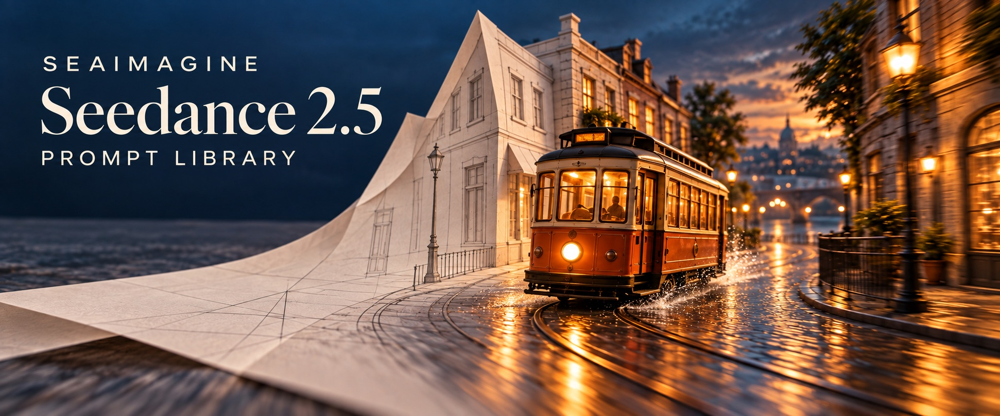
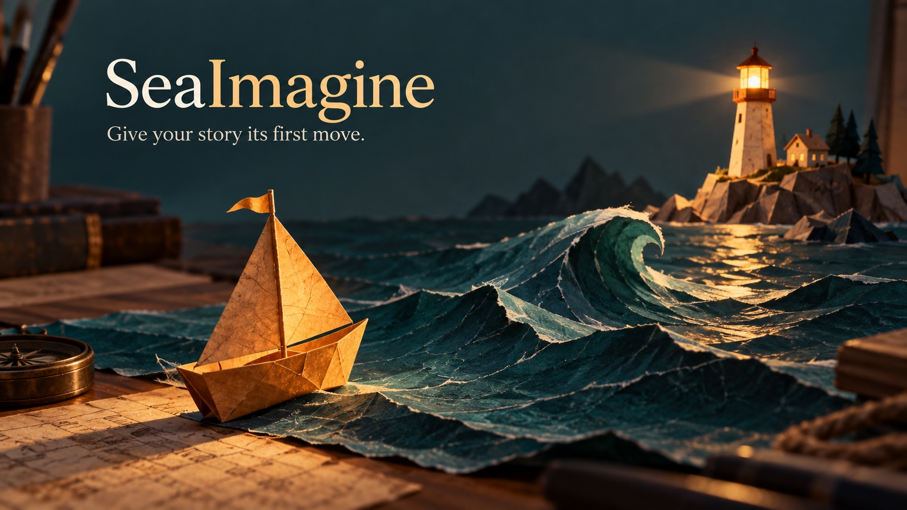

# Seedance 2.5: Videos ansehen, Prompts kopieren, selbst erstellen

[English](README.md) · [简体中文](README_ZH.md) · [繁體中文](README_TW.md) · [日本語](README_JA.md) · [Português](README_PT.md) · [Español](README_ES.md) · [Deutsch](README_DE.md) · [Русский](README_RU.md) · [Français](README_FR.md) · [한국어](README_KO.md) · [ไทย](README_TH.md) · [Tiếng Việt](README_VI.md) · [العربية](README_AR.md) · [Bahasa Indonesia](README_ID.md) · [Italiano](README_IT.md)



Eine eigene Szene veranschaulicht die Gestaltungsidee: von der Strukturskizze zu Materialien, Licht und Bewegung.

Die SeaImagine-Ausgabe basiert auf dem Flaq-Repository unseres Unternehmens: 120 Rezepte, davon 60 auf Chinesisch und 60 auf Englisch. Ergänzungen in 14 Sprachen enthalten jeweils sechs Übungen. Die 120 Rezepte wurden nicht vollständig in jede Sprache übersetzt.

## Mit einer Einstellung beginnen

Wähle eine Szene im Verzeichnis, kopiere den Prompt und passe Motiv, Materialien und Kamerabewegung an. Verwende nur Bilder, für die du die nötigen Rechte hast. Wähle in SeaImagine einen verfügbaren Eingabemodus und eine unterstützte Dauer; prüfe das Ergebnis vor einer Verlängerung.

[Sechs deutsche Übungen](prompts/i18n/prompt-library.de.md) · [Verzeichnis der 120 Rezepte · vereinfachtes Chinesisch](prompts/README.md)

## Von Community-Videos lernen

Die Modellangabe stammt vom jeweiligen Autor. Diese Videos stammen von externen Kreativen; wir haben nicht geprüft, ob sie mit SeaImagine erstellt wurden. Klicke auf das Vorschaubild für das Video und lies den Prompt im Originalbeitrag. Die Auswahl ist redaktionell und keine geprüfte Beliebtheitsrangliste.

### Kochen und passgenaue Geräusche

[](https://video.twimg.com/amplify_video/2099186062715404288/vid/avc1/1920x1080/H8uxwKxVsSU09_LW.mp4?tag=29)

[Originalbeitrag und Prompt des Autors](https://x.com/Goodmanprotocol/status/2099186117769822462) · **@Goodmanprotocol**

Achte darauf, wie Nahaufnahmen und synchronisierte Geräusche die komische Schlusswendung vorbereiten.

### Ein Kleidungsstück, mehrere Outfits

[](https://video.twimg.com/amplify_video/2095216899445649408/vid/avc1/1920x1080/LZt4YKiTkMag5Db1.mp4?tag=29)

[Originalbeitrag und Prompt des Autors](https://x.com/Goodmanprotocol/status/2095216981624721691) · **@Goodmanprotocol**

Farbe und Schnitt bleiben gleich; ähnliche Bewegungen verbinden die verschiedenen Outfits.

[Alle 12 Community-Beispiele · Englisch](README.md) · [Offizielle Beispiele und Quellen · Englisch](docs/official-examples.md)

## Aufbau eines Prompts

```text
[Ziel] Zielgruppe, Einsatz, Dauer, Seitenverhältnis
[Referenzen] genau eine Aufgabe pro Bild oder Video
[Konstanten] Identität, Produkt, Set und Licht bewahren
[Zeitachse] Aufbau → Handlung → Wendung → Schlussbild
[Kamera] Bildgröße, Höhe, Weg, Tempo, Fokus, Endpunkt
[Ton] Dialog, Atmosphäre, Geräusche, Musik, Synchronpunkte
[Vermeiden] Drift, Duplikate, Anatomiefehler, Fantasietext, Logos, Wasserzeichen
```

## Vollständigen Produkt-Prompt kopieren


Referenzbild aus dem Flaq-Quellrepository, kein Videoergebnis. Du kannst es direkt als Eingabebild für diese Übung verwenden.

Bereite ein Referenzbild einer Flasche ohne Marke vor. Dies ist eine Übung, nicht der Prompt der obigen Videos; ein Generierungstest wird nicht behauptet. Kürze oder teile die Sequenz entsprechend den Grenzen der Oberfläche.

```text
Verwende die Glasflasche aus Bild 1 als einzigen Produktanker. Silhouette, Verschluss, Proportionen des leeren Etiketts, Füllhöhe, Kondenswasser und Hauptlichtrichtung bleiben unverändert. Kein Text.

00:00–00:05 Makro auf einen Tropfen, dann Fokus auf feine Bläschen. 00:05–00:11 Uhrzeigersinn-Orbit um 35 Grad mit langsamem Rückzug; der Eissockel bricht das Licht natürlich, die Flasche bleibt stabil. 00:11–00:17 Warmes Gegenlicht zieht vorbei; der Deckel hebt sich nur leicht und gibt wenig Nebel frei. 00:17–00:24 Auf eine niedrige Produktperspektive sinken und frontal mit freiem Raum oben stoppen.

Ton: Deckel, Kohlensäure, Eis und minimaler Originalrhythmus. Keine Zusatzflasche, Etikettverschiebung, Glasverformung, Flüssigkeitsfehler, Fantasieschrift, Logos, Marken oder Wasserzeichen.
```

## Mit SeaImagine erstellen



Originalillustration, mit KI für dieses Repository erstellt; keine Videoausgabe von Seedance.

Übertrage die Übungen am Produkt — Form erhalten, Material beschreiben und Kamera führen — auf eine kleine Geschichte. Starte in SeaImagine mit Text und probiere diese Idee für 5 Sekunden aus. Die Übung wurde nicht durch eine Videogenerierung überprüft.

```text
5 Sekunden, eine durchgehende Einstellung. Ein goldenes Papiersegelboot fährt langsam über petrolblaue Papierwellen. Die Kamera folgt aus niedriger Position; ein ferner Leuchtturm spendet warmes Licht. Rumpf, Segel und Papierfasern bleiben unverändert. Sanfter Abschluss. Keine Schrift, Logos, zusätzlichen Boote oder Verformungen.
```

[SeaImagine · Seedance 2.5](https://seaimagine.com/de/model/seedance-2-5/) · [SeaImagine · Create](https://seaimagine.com/de/create/)

[Sechs deutsche Übungen](prompts/i18n/prompt-library.de.md) · [Verzeichnis der 120 Rezepte · vereinfachtes Chinesisch](prompts/README.md) · [Anleitung · Englisch](docs/seaimagine-workflow.md) · [Quellen und Zuordnung · Englisch](docs/PROVENANCE.md)

[Flaq · GitHub](https://github.com/flaqai/awesome_seedance_2_5) · [SeaImagine · GitHub](https://github.com/seaimagineai/awesome-seedance-2-5-prompts)
