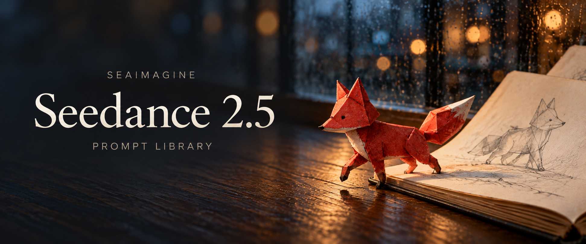

# Prompt Seedance 2.5: guarda, copia e crea

[English](README_EN.md) · [简体中文](README_ZH.md) · [繁體中文](README_TW.md) · [日本語](README_JA.md) · [Português](README_PT.md) · [Español](README_ES.md) · [Deutsch](README_DE.md) · [Русский](README_RU.md) · [Français](README_FR.md) · [한국어](README_KO.md) · [ไทย](README_TH.md) · [Tiếng Việt](README_VI.md) · [العربية](README_AR.md) · [Bahasa Indonesia](README_ID.md) · [Italiano](README_IT.md)



Dal riferimento al movimento: la volpe di carta esce dal quaderno.

Edizione SeaImagine basata sul repository Flaq della nostra azienda: 120 ricette, 60 in cinese e 60 in inglese. I supplementi in 14 lingue contengono sei esercizi ciascuno; le 120 ricette non sono tutte tradotte in ogni lingua.

## Inizia con una sola inquadratura

Scegli una scena dall’indice, copia il prompt e adatta soggetto, materiali e movimento della camera. Usa immagini per cui disponi dei diritti necessari. In SeaImagine seleziona modalità di ingresso e durata disponibili; controlla il risultato prima di estenderlo.

[Indice delle 120 ricette](prompts/README.md) · [Sei esercizi in italiano](prompts/i18n/prompt-library.it.md)

## Crea con SeaImagine

Apri la pagina Seedance per usare il modello. Con Create puoi preparare riferimenti visivi e trovare strumenti per immagini e video. Disponibilità, prezzi e limiti sono indicati nell’interfaccia. Le durate suggerite sono indicazioni creative, non garanzie del servizio.

[SeaImagine · Seedance 2.5](https://seaimagine.com/it/model/seedance-2-5/) · [SeaImagine · Create](https://seaimagine.com/it/create/)

## Impara dai video della community

L’indicazione del modello proviene dall’autore. Questi video sono opere di autori esterni; non abbiamo verificato se siano stati generati con SeaImagine. Fai clic sulla miniatura per guardare il video e leggi il prompt nel post originale. Sono riferimenti editoriali, non una classifica di popolarità verificata.

### Cucina e ritmo dei suoni

[](https://video.twimg.com/amplify_video/2099186062715404288/vid/avc1/1920x1080/H8uxwKxVsSU09_LW.mp4?tag=29)

[Post originale e prompt dell’autore](https://x.com/Goodmanprotocol/status/2099186117769822462) · **@Goodmanprotocol**

Osserva come dettagli degli ingredienti e suoni sincronizzati preparano il finale comico.

### Un capo, diversi abbinamenti

[](https://video.twimg.com/amplify_video/2095216899445649408/vid/avc1/1920x1080/LZt4YKiTkMag5Db1.mp4?tag=29)

[Post originale e prompt dell’autore](https://x.com/Goodmanprotocol/status/2095216981624721691) · **@Goodmanprotocol**

Mantieni colore e struttura del capo; collega gli abbinamenti con movimenti simili.

[Tutti i 12 esempi della community](README.md) · [Esempi ufficiali e fonti](docs/official-examples.md)

## Struttura del prompt

```text
[Obiettivo] pubblico, uso, durata e formato
[Riferimenti] un solo ruolo per ogni immagine o video
[Invarianti] identità, prodotto, set e luce da conservare
[Sequenza] apertura → azione → svolta → fotogramma finale
[Camera] inquadratura, altezza, percorso, velocità, fuoco e arresto
[Audio] dialogo, ambiente, effetti, musica e sincronizzazione
[Da evitare] deriva, duplicati, anatomia errata, testo falso, loghi e watermark
```

## Copia un prompt completo per un prodotto


Immagine di riferimento dal repository originale Flaq, non un risultato video. Puoi usarla direttamente come immagine di input per questo esercizio.

Prepara un’immagine di riferimento di una bottiglia senza marchio. È un esercizio, non il prompt dei video sopra, e non si dichiara alcun test di generazione. Riduci o suddividi la sequenza in base ai limiti dell’interfaccia.

```text
Usa la bottiglia di vetro trasparente dell'Immagine 1 come unico riferimento del prodotto. Mantieni invariati profilo, tappo, proporzioni dell'etichetta vuota, livello del liquido ambrato, condensa e direzione della luce principale. Non generare testo.

00:00–00:05: macro su una goccia di condensa, poi sposta il fuoco sulle bollicine che salgono. 00:05–00:11: orbita di 35 gradi in senso orario con lento arretramento; il piedistallo di ghiaccio rifrange la luce in modo naturale e la bottiglia resta stabile. 00:11–00:17: una luce calda passa dietro la bottiglia; il tappo si solleva appena con uno scatto pulito e libera una nebbia leggera. 00:17–00:24: abbassa la camera a un'angolazione hero discreta e termina su una vista frontale con spazio negativo in alto.

Audio: scatto del tappo, effervescenza fine, lieve suono del ghiaccio e ritmo originale minimale. Nessuna bottiglia aggiuntiva, etichetta instabile, vetro deformato, liquido che attraversa il contenitore, testo falso, logo, marchio o watermark.
```

[Sei esercizi in italiano](prompts/i18n/prompt-library.it.md) · [Indice delle 120 ricette](prompts/README.md) · [Guida alla creazione](docs/seaimagine-workflow.md) · [Fonti e attribuzione](docs/PROVENANCE.md)

[Flaq · GitHub](https://github.com/flaqai/awesome_seedance_2_5) · [SeaImagine · GitHub](https://github.com/seaimagineai/awesome-seedance-2-5-prompts)
