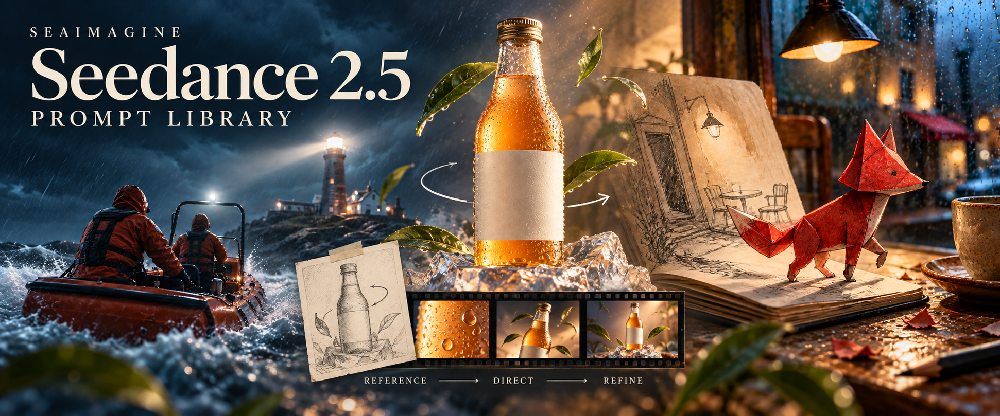

# Seedance 2.5 프롬프트: 보고, 복사하고, 만들기

[English](README_EN.md) · [简体中文](README_ZH.md) · [繁體中文](README_TW.md) · [日本語](README_JA.md) · [Português](README_PT.md) · [Español](README_ES.md) · [Deutsch](README_DE.md) · [Русский](README_RU.md) · [Français](README_FR.md) · [한국어](README_KO.md) · [ไทย](README_TH.md) · [Tiếng Việt](README_VI.md) · [العربية](README_AR.md) · [Bahasa Indonesia](README_ID.md) · [Italiano](README_IT.md)



참조 이미지 → 카메라 지시 → 장면 다듬기. 표지는 라이브러리의 폭풍 속 구조, 탄산차 광고, 종이 여우를 담았습니다.

사내 Flaq 원본 저장소를 SeaImagine에 맞게 편집했습니다. 레시피 120개는 중국어 60개와 영어 60개로 구성됩니다. 14개 언어의 보충 자료에는 언어별 연습 프롬프트 6개가 있으며, 120개 전체를 각 언어로 번역한 것은 아닙니다.

## 한 장면부터 시작하기

목록에서 장면을 고르고 프롬프트를 복사한 뒤 피사체, 재질, 카메라 움직임을 바꾸세요. 이미지는 사용 권한이 있는 자료를 준비하세요. SeaImagine 화면에서 지원하는 입력 방식과 길이를 선택하고, 결과를 확인한 뒤 연장하세요.

[레시피 120개 목록](prompts/README.md) · [한국어 연습 6개](prompts/i18n/prompt-library.ko.md)

## SeaImagine에서 만들기

모델을 사용하려면 Seedance 페이지를 여세요. 참조 이미지 준비와 이미지·영상 도구 선택은 Create에서 시작할 수 있습니다. 제공 여부, 가격, 제한은 실제 화면에서 확인하세요. 예시 길이는 연출 제안이며 서비스 보장이 아닙니다.

[SeaImagine · Seedance 2.5](https://seaimagine.com/ko/model/seedance-2-5/) · [SeaImagine · Create](https://seaimagine.com/ko/create/)

## 커뮤니티 영상에서 배우기

모델명은 작성자의 설명에 따른 것입니다. 외부 제작자의 작품이며, SeaImagine을 통해 생성했는지는 확인하지 않았습니다. 썸네일을 누르면 영상을 볼 수 있고, 원문 게시물에서 작성자의 프롬프트를 확인할 수 있습니다. 편집상 참고 사례이며 검증된 인기 순위가 아닙니다.

### 요리와 소리의 타이밍

[](https://video.twimg.com/amplify_video/2099186062715404288/vid/avc1/1920x1080/H8uxwKxVsSU09_LW.mp4?tag=29)

[작성자의 원문과 프롬프트](https://x.com/Goodmanprotocol/status/2099186117769822462) · **@Goodmanprotocol**

재료의 근접 촬영과 동작에 맞춘 소리가 마지막 웃음을 어떻게 준비하는지 살펴보세요.

### 옷 한 벌로 여러 스타일

[](https://video.twimg.com/amplify_video/2095216899445649408/vid/avc1/1920x1080/LZt4YKiTkMag5Db1.mp4?tag=29)

[작성자의 원문과 프롬프트](https://x.com/Goodmanprotocol/status/2095216981624721691) · **@Goodmanprotocol**

옷의 색과 구조를 유지하고 비슷한 동작으로 스타일 전환을 연결하세요.

[커뮤니티 사례 12개 전체](README.md) · [공식 사례와 출처](docs/official-examples.md)

## 프롬프트 기본 구조

```text
[목표] 사용자, 용도, 길이, 화면비
[참조 역할] 각 이미지나 영상에 한 가지 역할만 지정
[고정 요소] 인물, 제품, 공간, 조명 중 바뀌면 안 되는 항목
[타임라인] 도입 → 행동 → 전환점 → 최종 프레임
[카메라] 숏 크기, 높이, 경로, 속도, 초점, 정지 위치
[사운드] 대사, 환경음, 효과음, 음악, 동기화 지점
[금지] 형태 변화, 중복, 신체 오류, 가짜 글자, 로고, 워터마크
```

## 제품 영상 프롬프트 복사하기


Flaq 원본 저장소의 참조 이미지이며, 영상 생성 결과가 아닙니다. 이 연습의 입력 이미지로 바로 사용할 수 있습니다.

브랜드 표시가 없는 병의 참조 이미지 한 장을 준비하세요. 아래는 연습용이며 위 영상의 원본 프롬프트가 아닙니다. 생성 테스트를 마쳤다는 주장도 하지 않습니다. 화면의 제한에 맞춰 길이를 줄이거나 나누세요.

```text
이미지 1의 투명 유리병을 유일한 제품 기준으로 사용한다. 병 실루엣, 캡, 빈 라벨 비율, 호박색 액체 높이, 응결, 주광 방향을 유지하고 글자를 생성하지 않는다.

00:00–00:05 응결 방울 하나를 매크로로 촬영한 뒤 액체 안의 작은 기포로 초점을 이동한다. 00:05–00:11 시계 방향으로 35도 돌며 천천히 뒤로 이동하고, 얼음 받침의 굴절은 자연스럽게 변하지만 병은 안정적으로 유지한다. 00:11–00:17 따뜻한 역광이 지나가고 캡이 아주 조금 열리며 소량의 안개만 나온다. 00:17–00:24 낮은 히어로 앵글에서 상단 여백을 남기고 정면으로 멈춘다.

소리: 캡, 탄산, 얼음, 최소한의 오리지널 리듬. 추가 병, 라벨 이동, 유리 변형, 액체 관통, 가짜 문자, 로고, 상표, 워터마크 금지.
```

[한국어 연습 6개](prompts/i18n/prompt-library.ko.md) · [레시피 120개 목록](prompts/README.md) · [제작 안내](docs/seaimagine-workflow.md) · [출처와 기여 표기](docs/PROVENANCE.md)

[Flaq · GitHub](https://github.com/flaqai/awesome_seedance_2_5) · [SeaImagine · GitHub](https://github.com/seaimagineai/awesome-seedance-2-5-prompts)
