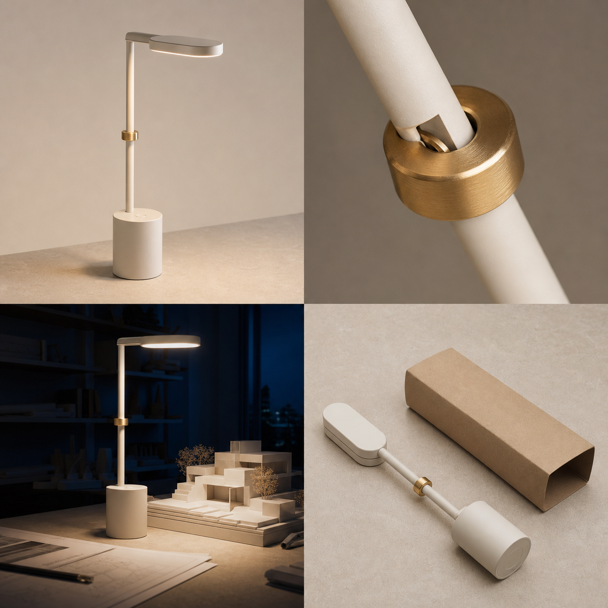

# Seedance 2.5 Creative Techniques — 28 Original Production Prompts

[Home](../README.md) · [120-prompt index](README.en.md) · [Prompting guide](../docs/prompting-guide.md) · [Submit a prompt](https://github.com/seaimagineai/awesome-seedance-2-5-prompts/issues/new?template=prompt.yml)

This collection expands the library with original prompts for match cuts, one-takes, multi-reference control, tutorials, video editing, digital presenters, batch product work, long-form planning, and production previs. The scenarios are written for the Flaq source collection and use fictional, unbranded subjects.

## Original reference board



The board is used by Prompts 73, 75, and 100. Treat its quadrants as separate crops in reading order: Image 1 product identity, Image 2 hinge detail, Image 3 environment and lighting, Image 4 folded end state. The reproducible generation brief is recorded in [Original Image Prompt Notes](../assets/IMAGE_PROMPTS.md).

## 73. Modular Lamp Match-Cut Identity Film

**Mode:** Multi-image reference · **Format:** 9:16 · **Duration:** 20 seconds

```text
Use the four supplied crops from the modular-lamp reference board. Image 1 is the only complete product-identity anchor. Image 2 controls the brass hinge detail only. Image 3 controls the midnight-blue studio and warm practical light only. Image 4 defines the folded final state. Preserve the lamp's cylindrical base, single stem, oval head, one brass ring, warm-white finish, and part count in every shot. Generate no brand or text.

Create five beat-matched shots with the brass ring centered at every cut. 00:00–00:04: macro ring detail rotates 15 degrees as the light turns on. 00:04–00:08: match cut to the upright lamp on pale stone; orbit 25 degrees while its shadow sweeps clockwise. 00:08–00:12: match cut to the night studio; the lamp illuminates the paper model as the camera slides right. 00:12–00:16: top-down view; the head folds toward the stem with credible hinge resistance. 00:16–00:20: match cut to the fully folded product beside the paper sleeve, then lock the camera.

Audio: five original muted percussion hits, switch click, hinge friction, quiet room tone. No extra rings, telescoping parts, label, floating product, sudden scale change, fake text, logo, or watermark.
```

## 74. One Take Through Four Working Worlds

**Mode:** Text-to-video · **Format:** 16:9 · **Duration:** 30 seconds

```text
Create one uninterrupted lateral tracking shot through four connected original workshops. A middle-aged craftsperson in a charcoal apron walks left to right at a constant natural pace; preserve face, age, apron, tool pouch, and body proportions throughout.

00:00–00:07: quiet bookbinding room, warm morning light, the craftsperson closes a stitched notebook and walks through an open arch. 00:07–00:14: ceramic studio, cool skylight; they turn one small clay bowl exactly once without stopping. 00:14–00:21: botanical dye room, green reflected light; hanging fabric moves in one consistent breeze and briefly occludes the lens to motivate the transition. 00:21–00:27: miniature theater workshop, amber practical lights; the craftsperson places the bowl beside a paper stage. 00:27–00:30: camera eases ahead and stops on the completed arrangement.

Audio transitions continuously: thread pull, pottery wheel, fabric rustle, tiny stage mechanism. No cuts, teleportation, duplicate person, room geometry collapse, costume change, trademarked craft, text, logo, or watermark.
```

## 75. Modular Lamp Assembly Tutorial

**Mode:** Multi-image tutorial · **Format:** 16:9 · **Duration:** 26 seconds

```text
Use Image 1 to lock the complete modular lamp and Image 2 to lock its brass hinge. Image 4 shows only the approved folded position. Show adult hands on a stable pale-stone workbench. The lamp is a fictional prototype; do not invent electrical certifications, safety ratings, battery life, materials claims, or tools not supplied.

00:00–00:05: overhead inventory—base, stem, oval head, brass ring, and one charging cable, each visible once. 00:05–00:11: align the stem with the base socket and press vertically until seated; no self-assembly. 00:11–00:17: attach the head at the hinge and tighten the single brass ring by hand, using a close side view. 00:17–00:22: raise the head to the Image 1 position and tap the unmarked power control once. 00:22–00:26: fold the lamp into the exact Image 4 end state and stop on a clean top-down view.

Audio: component contact, one hinge turn, one switch click, neutral narration describing only visible steps. No extra hardware, disappearing cable, hands crossing through parts, incorrect order, claims, generated captions, logo, or watermark.
```

## 76. Four-Flavor Botanical Cracker Rhythm Ad

**Mode:** Product image + motion-reference roles · **Format:** 9:16 · **Duration:** 18 seconds

```text
Image 1 locks one original round botanical cracker with a scalloped edge and blank center. Images 2–5 lock the four natural ingredient palettes: beet, spinach, pumpkin, and black sesame. Video 1 controls only the spiral camera path; Video 2 controls only the timing of hard cuts. Do not copy people, products, sets, music, or text from either video.

00:00–00:04: one cracker stays centered while its ingredient background changes on four original drum hits. 00:04–00:09: four crackers advance along separate shallow spiral paths without collision, preserving edge geometry. 00:09–00:13: overhead ordered grid moves one row at a time; color changes only at cuts. 00:13–00:16: one pumpkin cracker breaks naturally, revealing a dry layered crumb—not liquid filling. 00:16–00:18: the four flavors settle in a clean line with negative space for copy added later.

Audio: original dry percussion, four distinct ingredient foley accents, crisp break. No trademarked packaging, fruit explosion, fake health claim, extra flavors, crumbs becoming particles of light, generated text, logo, or watermark.
```

## 77. Remove Temporary Signage From a Street Clip

**Mode:** Local video editing · **Format:** Match source · **Duration:** Match source

```text
Edit Video 1 only. Remove the two temporary advertising boards marked by the supplied masks. Reconstruct the pavement, curb, and brick wall behind them using adjacent texture and perspective from the same video.

Preserve every person, bicycle, parked vehicle, storefront, shadow, reflection, camera move, frame timing, exposure, color, motion blur, and original audio exactly. Maintain correct occlusion when pedestrians pass in front of the reconstructed regions. Do not alter any permanent wayfinding or accessibility signage.

No crop, stabilization, reframing, new objects, face changes, vehicle changes, pavement repetition, texture swimming, lighting shift, audio replacement, text generation, logo insertion, or watermark.
```

## 78. Change Only the Weather on a Tram Platform

**Mode:** Video editing · **Format:** Match source · **Duration:** Match source

```text
Edit Video 1 by changing only the clear midday weather outside the covered tram platform to a light, steady autumn rain. Preserve people, identities, clothing, tram design, timetable, platform geometry, camera motion, action timing, and all readable supplied text.

Add physically consistent rain beyond and at the open edges of the roof, small wet reflections on exposed pavement, restrained droplets on the glass barrier, and cooler diffused daylight. Covered benches and people under the roof remain mostly dry. Existing footsteps and tram sounds stay unchanged; add low rain ambience without masking announcements.

No storm, lightning, flooding, wardrobe change, umbrellas appearing from nowhere, altered timetable, extra tram, face drift, camera change, fake text, logo, or watermark.
```

## 79. Six-Color Desk Organizer SKU Batch

**Mode:** Image-to-video batch template · **Format:** 1:1 · **Duration:** 10 seconds each

```text
Create six separate videos from the six approved product images, one output per SKU. Each image is the sole identity and color anchor for its own unbranded modular desk organizer. Across outputs, preserve identical camera path, timing, set, lighting, object count, component geometry, and hand action; only the approved product color differs.

00:00–00:03: locked three-quarter view, slow 15-degree orbit. 00:03–00:07: an adult hand slides out the shallow tray, places one plain pencil inside, and closes it. 00:07–00:10: raise the camera slightly and stop on the same catalog framing with upper-left negative space.

Audio: drawer glide, pencil contact, one soft original tonal hit. No cross-contamination between colors, material change, extra stationery, altered hand, different camera speed, text, price, logo, or watermark. Use the same seed and settings where the platform supports them, then review all six outputs side by side.
```

## 80. Honest Livestream Demonstration of a Travel Kettle

**Mode:** Authorized presenter + product reference · **Format:** 9:16 · **Duration:** 24 seconds

```text
Image 1 locks the adult presenter's identity, navy shirt, and neutral kitchen counter. Image 2 locks the unbranded foldable travel kettle's silicone body, lid, handle, base, and blank measurement marks. Present only observable features; do not mention discounts, urgency, safety certification, boiling speed, capacity, energy use, or health benefits.

00:00–00:05: medium close-up; presenter says once, “Here is how it folds for storage.” 00:05–00:11: overhead view as both hands collapse the empty kettle in two controlled stages. 00:11–00:17: presenter expands it fully, rotates it 90 degrees, and shows the handle connection. 00:17–00:21: place it beside a plain mug for scale without claiming measurements. 00:21–00:24: presenter says, “Check the specifications for your model before use,” and camera settles.

Audio: natural speech, silicone movement, counter contact, quiet room tone. No hot liquid, fake steam, exaggerated reaction, identity drift, hand errors, added accessories, price, subtitle, logo, or watermark.
```

## 81. Multilingual Museum Guide in Five Deliverables

**Mode:** Authorized digital presenter · **Format:** 16:9 · **Duration:** 15 seconds per language

```text
Image 1 locks the authorized adult museum guide's identity, age, hairstyle, charcoal jacket, and position in the approved gallery. Audio 1–5 contain approved English, Simplified Chinese, Japanese, Spanish, and Arabic scripts spoken by the same consenting guide. Create five separate versions, one language per output; use the matching supplied audio exactly and do not clone, translate, or invent speech.

In every version, keep the same locked medium shot and restrained performance: guide faces the lens, gestures once toward the original abstract sculpture at 00:06, then returns both hands to a neutral position. Match lips and jaw to the supplied audio while preserving facial identity and natural blinking. For Arabic, do not mirror the gallery or gesture direction.

Audio: selected supplied voice plus quiet gallery ambience. No mixed languages, added narration, age change, exaggerated gestures, animated artwork, generated subtitles, altered signage, logo, or watermark.
```

## 82. Precision Hand-Grinder Setup Guide

**Mode:** Six reference images · **Format:** 16:9 · **Duration:** 30 seconds

```text
Images 1–6 show approved stages of an original manual coffee grinder: parts inventory, burr seating, axle insertion, adjustment ring, handle attachment, and finished state. Preserve the exact component count, burr direction, thread orientation, finish, and blank markings. Show adult hands and describe only the supplied assembly sequence.

00:00–00:04: top-down inventory with all parts separated. 00:04–00:09: seat the burr vertically without spinning. 00:09–00:14: insert the axle through the approved opening. 00:14–00:19: screw the adjustment ring clockwise by two visible turns. 00:19–00:24: attach the handle and confirm free rotation once. 00:24–00:30: place the assembled grinder upright and show a side-by-side visual check against Image 6.

Audio: clear neutral narration, metal contact, two thread turns, one handle rotation. No missing washers, self-moving parts, coffee beans, grind-size claim, unsafe force, unreadable captions, logo, or watermark.
```

## 83. Financial-App Presenter Without Advice or Claims

**Mode:** Presenter image + approved UI states · **Format:** 9:16 · **Duration:** 20 seconds

```text
Image 1 locks the consenting adult presenter's identity and plain studio. Images 2–4 are the only approved screens for a fictional budgeting prototype: category setup, monthly plan, and reminder. Preserve every supplied label and value. This is a feature walkthrough, not financial advice; do not invent returns, savings outcomes, recommendations, ratings, bank connections, or security claims.

00:00–00:05: presenter says, “This prototype groups a plan into categories you choose.” 00:05–00:11: over-shoulder device view transitions from Image 2 to Image 3 after one tap. 00:11–00:16: the supplied reminder enters once; presenter selects the approved dismiss action. 00:16–00:20: return to presenter, who says, “Review the details before making decisions.”

Audio: approved speech, two taps, one restrained alert. No fabricated UI, investment language, currency change, identity drift, extra notifications, subtitles, third-party logo, or watermark.
```

## 84. Why a Suspension Bridge Moves in Wind

**Mode:** Educational diagram-to-video · **Format:** 16:9 · **Duration:** 28 seconds

```text
Use the supplied original bridge diagram as the fixed geometry: deck, towers, main cables, hangers, wind arrows, and dampers. Explain the general concept of wind-induced oscillation for secondary-school students without referring to a real bridge, accident, engineering approval, or numeric safety threshold.

00:00–00:06: lateral wind arrows reach the deck; the deck begins a small exaggerated-for-teaching vertical motion. 00:06–00:13: switch to a cross-section showing alternating pressure above and below while the camera remains orthographic. 00:13–00:20: reveal the supplied damper locations and show the oscillation reducing gradually. 00:20–00:25: compare uncontrolled and damped schematic motion side by side. 00:25–00:28: stop on the full labeled system.

Audio: calm original narration, light wind, restrained mechanical tone. Render only approved labels. No collapse, disaster imagery, false formula, unverified percentage, wrong cable attachment, decorative traffic, logo, or watermark.
```

## 85. Neutral Digestive-System Classroom Animation

**Mode:** Scientific illustration reference · **Format:** 16:9 · **Duration:** 25 seconds

```text
Animate the supplied original simplified digestive-system illustration for a general classroom overview. Preserve the approved organ shapes, relative positions, arrows, and six labels. Use a non-graphic flat educational style. Do not diagnose, recommend treatment, show disease, or imply exact transit times.

00:00–00:05: highlight mouth and esophagus as one simple food icon moves downward. 00:05–00:11: stomach highlights; icon breaks into smaller neutral particles. 00:11–00:18: particles move through the small intestine while soft arrows indicate absorption conceptually. 00:18–00:22: remaining particles pass to the large intestine. 00:22–00:25: return to the complete diagram and exact supplied labels.

Audio: approved educational narration, subtle movement cues, no dramatic effects. No realistic internal tissue, pain, medical claim, incorrect pathway, extra organs, character face, garbled text, logo, or watermark.
```

## 86. From Shell Tokens to Contactless Payment

**Mode:** Museum explainer · **Format:** 16:9 · **Duration:** 30 seconds

```text
Create a neutral visual history using only the supplied, rights-cleared generic objects: shell tokens, stamped metal discs, printed paper notes, magnetic card, chip card, and contactless device. Present these as simplified examples rather than a universal linear history. Do not show real currency, governments, banks, logos, values, or investment claims.

00:00–00:05: shell tokens exchange hands on a plain table. 00:05–00:10: circular match cut to generic stamped metal discs. 00:10–00:15: the disc becomes the seal on a blank paper note. 00:15–00:20: match cut the note edge to a blank magnetic card. 00:20–00:25: macro reveals a generic chip pattern. 00:25–00:30: one unbranded device taps another; finish on all six objects arranged as parallel examples.

Audio: neutral narration, material-specific foley, original minimal score. No claim that one form replaced all others, fake historical date, readable currency, company mark, transaction amount, or watermark.
```

## 87. Collaborative Robot Visual Inspection Cell

**Mode:** Industrial reference-to-video · **Format:** 16:9 · **Duration:** 24 seconds

```text
Images 1–3 lock an original collaborative robot, inspection camera, safety cell, conveyor direction, and one unbranded machined part. Preserve joint count, gripper, guard placement, emergency-stop location, and part geometry. Depict an authorized demonstration with no worker inside the active cell.

00:00–00:05: wide locked shot establishes the stopped cell and clear safety boundary. 00:05–00:11: conveyor moves one part to the fixture and stops before the robot begins. 00:11–00:17: robot rotates through three plausible joints, picks the part, and holds it under the fixed inspection camera. 00:17–00:21: green approved-state light appears only after inspection; robot places the part in the pass tray. 00:21–00:24: all movement stops on the original wide view.

Audio: conveyor, servo movement, gripper click, one status tone. No person in cell, bypassed guard, unsafe speed, extra robot, part teleportation, certification claim, text, brand, or watermark.
```

## 88. Warehouse Inventory Drone FPV Training Preview

**Mode:** White-model path reference · **Format:** 16:9 · **Duration:** 20 seconds

```text
Video 1 is a white-model previs that controls only the drone camera path and timing through a fictional closed warehouse aisle. Images 1–2 lock the final warehouse materials and a small caged inventory drone. Do not copy textures or objects from the previs. No people are present during the demonstration.

Follow the previs path exactly: 00:00–00:05 rise vertically from the marked launch pad to 2.5-meter shelf height; 00:05–00:12 travel forward at constant low speed, centered in the aisle; 00:12–00:16 stop at one supplied blank inventory marker and rotate 30 degrees; 00:16–00:20 reverse slowly to the launch pad and land. Maintain clearance from shelves and show stable obstacle avoidance without claims.

Audio: restrained propeller sound, warehouse room tone, one scan cue. No racing speed, workers, falling packages, readable real codes, invented interface, camera deviation, brand, or watermark.
```

## 89. Synthetic Robot-Picking Dataset Variations

**Mode:** Controlled batch generation · **Format:** 16:9 · **Duration:** 8 seconds each

```text
Generate a controlled set of 12 fictional simulation clips for testing object-tracking software. The same six-axis robot, two-finger gripper, blue cube, gray table, camera position, action timing, and uncluttered simulation style remain fixed. Vary exactly one approved factor per clip: three light directions, two cube starting positions, and two background gray levels, covering all combinations.

Every clip: 00:00–00:02 robot stationary and cube visible; 00:02–00:05 gripper approaches and closes around the cube; 00:05–00:08 cube lifts 10 centimeters and holds. Motion must be repeatable with no contact penetration. Output a manifest linking each clip to its factor combination.

No real factory, person, trademark, unsafe setup, unlisted variation, random camera, extra object, missing frame, annotation baked into video, or watermark. This is synthetic test media, not a safety validation claim.
```

## 90. Electric Shuttle Interior Accessibility Walkthrough

**Mode:** Interior references · **Format:** 16:9 · **Duration:** 26 seconds

```text
Images 1–4 lock a fictional low-floor electric shuttle interior: entry ramp, priority bay, handrails, stop controls, seat count, and neutral material palette. Preserve dimensions and circulation. Demonstrate visible features without claiming legal compliance, universal access, range, autonomy, or safety certification.

00:00–00:06: enter at adult eye height through the open door while the deployed ramp remains fully visible. 00:06–00:12: track along the clear aisle to the priority bay, showing turning space honestly without ultra-wide distortion. 00:12–00:17: close view of one supplied stop control activated by an adult hand. 00:17–00:22: continue to the rear seating with correct handrail occlusion. 00:22–00:26: return to a centered wide view from the priority bay.

Audio: door mechanism, footsteps, one confirmation tone, quiet vehicle ambience. No moving vehicle, passenger stereotype, touching mobility equipment, added seats, impossible width, compliance claim, text, logo, or watermark.
```

## 91. Floor Plan to Honest Furnished Studio

**Mode:** Floor plan + material board · **Format:** 16:9 · **Duration:** 22 seconds

```text
Image 1 is the fixed floor plan of an original 28-square-meter studio. Image 2 controls only approved flooring, wall color, cabinetry, and upholstery. Preserve outer walls, window, entry, bathroom, kitchenette, furniture count, door swing, and true proportions. Do not invent a view, storage, balcony, room, or floor-area claim.

00:00–00:05: orthographic top-down floor plan with no labels. 00:05–00:11: walls rise vertically while approved materials appear one category at a time; camera remains top-down. 00:11–00:16: camera descends into the entry at natural eye height without passing through geometry. 00:16–00:22: one calm forward move reveals kitchenette, bed, and window in their correct relationship, then stops.

Audio: restrained construction foley, room tone, no narration. No magical furniture rearrangement, wall drift, ultra-wide stretching, daylight inconsistency, added décor, text, logo, or watermark.
```

## 92. Community Lantern Workshop Seasonal Film

**Mode:** Text-to-video · **Format:** 9:16 · **Duration:** 24 seconds

```text
Create an original seasonal community film in a neighborhood craft hall. Show diverse adults and children making simple paper lanterns under supervision, without copying a named festival, religious ceremony, national costume, or protected design.

00:00–00:05: macro of plain paper folded along a ruler by adult hands. 00:05–00:11: child and guardian attach a safe battery light; hands remain anatomically correct and the light stays cool. 00:11–00:17: track past four tables as finished lanterns vary in shape and color but contain no symbols or writing. 00:17–00:21: doors open to a quiet courtyard at blue hour. 00:21–00:24: participants raise lanterns to shoulder height and stop, leaving clear sky space for copy added later.

Audio: paper, soft conversation without intelligible private speech, door, original gentle percussion. No flame, flying lantern, cultural stereotype, crowd crush, child alone, generated text, logo, or watermark.
```

## 93. Tiny Rabbit Night-Train Conductor

**Mode:** Character image-to-video · **Format:** 9:16 · **Duration:** 20 seconds

```text
Image 1 locks an original small gray rabbit character with one folded ear, round glasses, navy vest, brass pocket watch, and compact proportions. Image 2 locks a miniature midnight train carriage made from painted wood. Preserve character silhouette, clothing, glasses, watch, carriage scale, window count, and handcrafted texture.

00:00–00:05: rabbit checks the pocket watch under a warm carriage lamp. 00:05–00:10: it walks three short steps down the aisle with believable foot contact while the train sways gently. 00:10–00:15: it reaches a sleeping paper-moth passenger, carefully pulls up a tiny blanket, and adjusts the lamp lower. 00:15–00:20: camera follows to the rear window where distant painted hills move slowly; rabbit closes the watch and smiles once.

Audio: rail rhythm, watch click, fabric, soft original celesta. No franchise resemblance, extra limbs, human hands, costume drift, changing carriage, spoken dialogue, text, logo, or watermark.
```

## 94. Wheelchair Basketball Motion Reference

**Mode:** Authorized athlete + motion reference · **Format:** 16:9 · **Duration:** 15 seconds

```text
Image 1 locks the authorized adult athlete's identity, jersey, sport wheelchair geometry, wheel camber, straps, gloves, and body proportions. Video 1 controls only the approved chair maneuver: two pushes, controlled pivot, one pass. Do not copy the reference athlete, venue, uniform, camera, or audio.

Recreate the maneuver on the supplied empty practice court. 00:00–00:04: low side track during exactly two pushes. 00:04–00:09: athlete lowers center of mass and completes the controlled pivot with both wheels maintaining believable contact. 00:09–00:13: athlete makes one chest pass to an off-camera adult teammate. 00:13–00:15: camera stops as the athlete looks toward the receiver. Maintain sport-specific chair behavior and dignified athletic framing.

Audio: wheel contact, two glove pushes, ball pass, quiet court. No collision, fall, miraculous movement, equipment redesign, inspirational stereotype, crowd, sponsor, text, or watermark.
```

## 95. Five-Language A Cappella Greeting Film

**Mode:** Authorized ensemble + supplied vocals · **Format:** 16:9 · **Duration:** 20 seconds

```text
Image 1 locks five consenting adult singers, their clothing, positions, and a simple rehearsal room. Audio 1 contains an original a cappella arrangement with one approved greeting line each in English, Japanese, Spanish, Arabic, and Vietnamese. Preserve which singer performs each line; do not clone, translate, extend, or replace any voice.

Create five connected shots, one line per shot, cutting only at phrase boundaries: wide semicircle, close singer 1, lateral two-shot, slow 20-degree arc, final balanced wide. The non-singing performers breathe and listen naturally. Mouth timing follows the supplied recording; Arabic reading direction does not mirror performer placement. Finish on two seconds of quiet shared eye contact.

Audio: supplied vocals and natural room reflections only. No instrumental imitation, overlapping new words, language swap, identity drift, extra singer, choreography, subtitle, logo, or watermark.
```

## 96. Six-Chapter Coastal Radio Mystery

**Mode:** Long-form chained generation · **Format:** 16:9 · **Total:** 120–150 seconds

```text
Create a six-chapter original mystery as six separately generated clips joined in editing. Image 1 locks the adult radio technician's identity, yellow rain jacket, field recorder, and compact van. Image 2 locks a remote fictional coastal relay station. Maintain character, wardrobe, vehicle, weather direction, geography, prop count, and sound motif across every chapter.

Chapter 1: technician receives a repeating three-note signal in the van and looks toward the dark relay tower. Chapter 2: walks the marked cliff path in light rain; no dangerous edge behavior. Chapter 3: enters the station and discovers the signal comes from a loose wind sensor. Chapter 4: repairs the connector with power isolated and verifies it visually. Chapter 5: signal resolves into normal weather telemetry; storm light softens. Chapter 6: returns to the van at dawn and records a short factual maintenance note.

Each chapter must open from the prior chapter's approved final frame and end on a two-second continuity handle. Audio: consistent rain, wind, three-note electronic motif, tool foley, sparse original score. No supernatural reveal, brand, real location, unsafe electrical work, outfit drift, added person, fake readable data, or watermark.
```

## 97. Extend a Bicycle Repair Scene by Ten Seconds

**Mode:** Video extension · **Format:** Match source · **Extension:** 10 seconds

```text
Extend Video 1 by exactly 10 seconds from its final frame. Preserve the adult mechanic's identity, green coveralls, bicycle model, tool placement, workshop geography, fluorescent flicker phase, camera height, lens character, color, grain, and original ambient sound.

Continue the existing action causally: 00:00–00:04 mechanic completes the current clockwise pedal rotation and watches the chain settle. 00:04–00:07 they stop the crank with the left hand and place the existing wrench back in its marked tray. 00:07–00:10 they step half a pace back, inspect the bicycle, and the camera decelerates to a stable final frame. Add no cut or new task.

No repeated frames, reversed motion, new tool, chain redesign, bicycle color change, camera jump, new person, dialogue, music, text, logo, or watermark.
```

## 98. Replace Only a Blank Package Color Region

**Mode:** Region video editing · **Format:** Match source · **Duration:** Match source

```text
Edit Video 1 only inside the supplied package-body mask. Change the unbranded carton from pale gray to the approved muted teal while preserving its blank surface. Keep folds, edges, texture, highlights, shadows, perspective, motion blur, hand occlusion, and reflections physically consistent throughout the clip.

Everything outside the mask must remain pixel-consistent in content: adult hands, table, background, camera path, timing, exposure, audio, and object count. Do not add a label, design, claim, pattern, barcode, seal, or typography.

No color spill onto fingers or table, flicker, unstable mask edge, changed package geometry, new reflections, reframing, audio change, logo, text, or watermark.
```

## 99. White-Model Café Blocking to Final Materials

**Mode:** White-model reference + final material images · **Format:** 16:9 · **Duration:** 25 seconds

```text
Video 1 is a white-model previs controlling only the café geometry, camera path, actor blocking, door occlusion, and timing. Images 1–3 control final wall, floor, furniture, and warm evening-light materials. Image 4 locks the identities and neutral uniforms of two consenting adult performers. Do not copy people, textures, or lighting from the previs.

Recreate the previs exactly: camera enters at adult eye height, passes behind the supplied column, tracks Performer A carrying one tray to table three, then pans to Performer B opening the side door. Preserve table count, aisle width, walking pace, tray level, sight lines, and final camera stop. Apply final materials consistently with correct reflections and contact shadows.

Audio: quiet café room tone, four footsteps, tray contact, door latch. No extra customers, table movement, wall crossing, altered identity, branded cup, invented signage, ultra-wide distortion, logo, or watermark.
```

## 100. Reference-Board Product Campaign Storyboard

**Mode:** Four-image storyboard-to-video · **Format:** 16:9 master with 9:16 safe zone · **Duration:** 24 seconds

```text
Use the four crops from the modular-lamp reference board as a compact campaign storyboard. Image 1 locks complete product identity. Image 2 is the approved detail insert. Image 3 controls environment and practical lighting. Image 4 is the required final product state. Preserve the lamp's geometry, single brass ring, material, finish, and scale. All campaign typography will be added in post.

00:00–00:05: begin from Image 1 composition; slow push while the lamp turns on. 00:05–00:09: cut to Image 2 macro and rack focus across the ring without moving parts. 00:09–00:16: transition through a circular brass-ring wipe into Image 3; track past the illuminated paper model while the product remains sharp. 00:16–00:21: an adult hand folds the lamp in two controlled movements. 00:21–00:24: arrive at the exact Image 4 composition and hold for three seconds inside both horizontal and vertical safe zones.

Audio: original minimal electronic pulse, switch click, hinge movement, quiet night room tone. No extra product, redesign, hand deformation, floating model, invented packaging copy, logo, trademark, subtitle, or watermark.
```

## Production notes

- Split contact sheets into individual input files before uploading when the platform expects separate references.
- Give each reference exactly one job and state priority when two references could conflict.
- For editing prompts, define the mutable region first, then repeat everything that must stay unchanged.
- For batch and long-form work, record prompt version, asset order, settings, seed when supported, final-frame handles, and rejection reasons.
- Use only original, licensed, or authorized people, voices, products, interfaces, music, footage, and reference assets.
